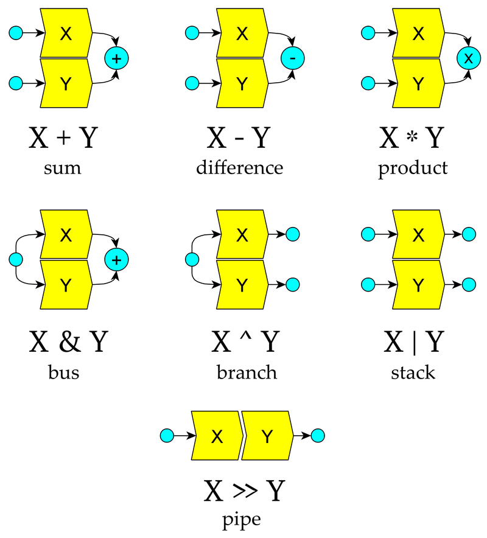

# FunDSP

## Audio Processing and Synthesis Library for Rust

[FunDSP](https://github.com/SamiPerttu/fundsp)
is an audio DSP ([digital signal processing](https://en.wikipedia.org/wiki/Digital_signal_processing)) library with a focus on usability.

FunDSP features a powerful inline graph notation that
empowers users to accomplish diverse audio processing tasks with ease and elegance.

The custom notation taps into composable, zero-cost abstractions
that express audio processing networks as [Rust](https://www.rust-lang.org/) types.

FunDSP comes with a combinator environment containing
a suite of audio components, math and utility functions and procedural generation tools.

*This project is under construction*! It is already useful for experimentation.
However, some standard components are missing and breakage can be expected as we continue to experiment with best practices.

### Uses

- Audio processing and synthesis for games and applications
- Education
- Music making
- Sound hacking and audio golfing
- Prototyping of DSP algorithms

### Graph Notation

*FunDSP Composable Graph Notation* expresses audio networks
in algebraic form, using graph operators. It
was developed together with the functional
environment to minimize the number
of typed characters needed to accomplish common audio tasks.

Many common algorithms can be expressed in a natural form
conducive to understanding.
For example, an [FM oscillator](https://ccrma.stanford.edu/~jos/sasp/Frequency_Modulation_FM_Synthesis.html)
can be written simply as:

```rust
sine_hz(f) * f * m + f >> sine()
```

The above expression defines an audio graph that is
compiled into a stack allocated, inlined form using
the powerful generic abstractions built into [Rust](https://www.rust-lang.org/).
Connectivity errors are detected during compilation, saving
development time.

### Audio DSP Becomes a First-Class Citizen

With no macros needed, the FunDSP graph notation
integrates audio DSP tightly into the [Rust programming language](https://www.rust-lang.org/)
as a first-class citizen. Native Rust operator precedences
work in harmony with the notation, minimizing 
the number of parentheses needed.

FunDSP graph expressions offer even more economy in being generic
over channel arities, which are encoded at the type level.
A mono network can be expressed
as a stereo network simply by replacing its mono generators and
filters with stereo ones, the graph notation remaining the same.

FunDSP Composable Graph Notation was developed by Sami Perttu,
with contributions from Benjamin Saunders.


## Basics

### Component Systems

There are two parallel component systems: the static `AudioNode` and the dynamic `AudioUnit`.

Both systems operate on audio signals synchronously as an infinite stream.

---

| Trait         | Sample Type    | Dispatch             | Allocation Strategy | Connectivity |
| ------------- | -------------- | -------------------- | --------------- | ---------------- |
| `AudioNode`   | generic        | static, inlined      | stack           | input and output arity fixed at compile time |
| `AudioUnit`   | `f32` or `f64` | dynamic, object safe | heap            | input and output arity fixed after construction |

---

The lower level `AudioNode`s can be lifted to dynamic mode
with the object safe `AudioUnit` interface via the `AnUnit<X: AudioNode>` wrapper.

`AudioNode`s can be stack allocated for the most part.
Some nodes may use the heap for audio buffers and the like.

### Sample Rate Independence

Of the signals flowing in graphs, some contain audio while others are controls of different kinds.

With control signals and parameters in general, we prefer to use natural units like Hz and seconds.
It is useful to keep parameters independent of the sample rate, which we can then adjust as we like.

In addition to sample rate adjustments, natural units enable support for
selective oversampling in nested sections that are easy to configure and modify.

Some low-level components ignore the sample rate by design, such as the single sample delay `tick()`.

The default sample rate is 44.1 kHz.
In both systems, a component `A` can be reinitialized with a new sample rate: `A.reset(Some(sr))`.


## Audio Processing Environment

FunDSP prelude defines a convenient combinator environment for audio processing.

There are two name-level compatible versions of the prelude.

The default environment (`fundsp::prelude`) offers a generic interface.
It is flexible and attempts to conform to Rust practices.

The hacker environment (`fundsp::hacker`) for audio hacking
is fully 64-bit to minimize type annotations and maximize audio quality.
The hacker interface uses 1 floating point type (`f64`) and 1 integer type (`i64`) only.

An application interfacing `fundsp` will likely pick the default environment for maximum flexibility,
while experimenters will be drawn to the succinctness of the hacker prelude.

The aims of the environments are:

- Minimize the number of characters needed to type to express an idiom.
- Keep the syntax clean so that a subset of the hacker environment
  can be parsed straightforwardly as a high-level DSL for quick prototyping.
- Make the syntax usable even to people with no prior exposure to programming.
- Exemplify an effective procedural style.

### Deterministic Pseudorandom Phase

FunDSP uses a deterministic pseudorandom phase system for generators.
Generator phases are seeded from network structure and node location.

Thus, two identical networks sound identical separately but different when combined.
This means that `noise() | noise()` is a stereo noise source, for example.


## Operators

Custom operators are available for combining audio components inline.
In order of precedence, from highest to lowest:

---

| Expression     | Meaning                       | Inputs  | Outputs | Notes                                       |
| -------------- | ----------------------------- |:-------:|:-------:| ------------------------------------------- |
| `-A`           | negate `A`                    | `a`     | `a`     | Negates any number of outputs, even zero.   |
| `!A`           | thru `A`                      | `a`     | same as inputs | Passes through extra inputs. |
| `A * B`        | multiply `A` with `B`         | `a`&#160;`+`&#160;`b` | `a`&#160;`=`&#160;`b` | Aka amplification, or ring modulation when both are audio signals. Number of outputs in `A` and `B` must match. |
| `A`&#160;`*`&#160;`constant` | multiply `A`    | `a`     | `a`     | Broadcasts constant. Same applies to `constant * A`. |
| `A + B`        | sum `A` and `B`               | `a`&#160;`+`&#160;`b` | `a`&#160;`=`&#160;`b` | Aka mixing. Number of outputs in `A` and `B` must match. |
| `A`&#160;`+`&#160;`constant` | add to `A`      | `a`     | `a`     | Broadcasts constant. Same applies to `constant + A`. |
| `A - B`        | difference of `A` and `B`     | `a`&#160;`+`&#160;`b` | `a`&#160;`=`&#160;`b` | Number of outputs in `A` and `B` must match. |
| `A`&#160;`-`&#160;`constant` | subtract from `A` | `a`   | `a`     | Broadcasts constant. Same applies to `constant - A`. |
| `A >> B`       | pipe `A` to `B`               | `a`     | `b`     | Aka chaining. Number of outputs in `A` must match number of inputs in `B`. |
| `A & B`        | bus `A` and `B` together      | `a`&#160;`=`&#160;`b` | `a`&#160;`=`&#160;`b` | Sum `A` and `B`. `A` and `B` must have identical connectivity. |
| `A ^ B`        | branch input to `A` and `B` in parallel | `a`&#160;`=`&#160;`b` | `a`&#160;`+`&#160;`b` | Number of inputs in `A` and `B` must match. |
| `A \| B`       | stack `A` and `B` in parallel | `a`&#160;`+`&#160;`b` | `a`&#160;`+`&#160;`b` | Concatenates `A` and `B` inputs and outputs. |

---

In the table, `constant` denotes an `f32` or `f64` value.

All operators are associative, except the left associative `-`.


### Operators Diagram



### Broadcasting

Arithmetic operators are applied to outputs channel-wise.

Arithmetic between two components never broadcasts channels: channel arities have to match always.

Direct arithmetic with `f32` and `f64` values, however, broadcasts to an arbitrary number of channels.

The negation operator broadcasts also: `-A` is equivalent with `(0.0 - A)`.

For example, `A * constant(2.0)` and `A >> mul(2.0)` are equivalent and expect `A` to have one output.
On the other hand, `A * 2.0` works with any `A`, even *sinks*.

#### Thru

The thru (`!`) operator is syntactic sugar for chaining filters with similar connectivity.

It adjusts output arity to match input arity and passes through any missing outputs to the next node.
The missing outputs are parameters to the filter.

For example, while `lowpass()` is a 2nd order lowpass filter, `!lowpass() >> lowpass()`
is a steeper 4th order lowpass filter with identical connectivity.

### Generators, Filters and Sinks

Components can be broadly classified into generators, filters and sinks.
*Generators* have only outputs, while *filters* have both inputs and outputs.

Sinks are components with no outputs. Direct arithmetic on a sink translates to a no-op.
In the prelude, `sink()` returns a mono sink.

### Graph Combinators

Of special interest among operators are the four custom combinators:
*pipe* ( `>>` ), *bus* ( `&` ), *branch* ( `^` ),  and *stack* ( `|` ).

The pipe is a serial operator where components appear in *processing* order. Branch, stack, and
arithmetic operators are parallel operators where components appear in *channel* order.

Bus is a commutative operator where components may appear in any order.
The other operators are not commutative in general.

All four are fully associative, and
each come with their own connectivity rules.

#### Pipe

The pipe ( `>>` ) operator builds traditional processing chains akin to composition of functions.
In `A >> B`, each output of `A` is piped to a matching input of `B`, so
the output arity of `A` must match the input arity of `B`.

It is possible to pipe a sink to a generator. This is similar to stacking.
Processing works as normal and the sink processes its inputs before the generator is run.

#### Branch

Where the arithmetic operators are reducing in nature,
the branch ( `^` ) operator splits a signal into parallel branches.

In `A ^ B`, both components receive the same input but their outputs are disjoint.
Because the components receive the same input, the number of inputs in `A` and `B` must match.
In `A ^ B`, the outputs of `A` appear first, followed with outputs of `B`.

Branching is useful for building *banks* of components such as filters.

#### Bus

The bus ( `&` ) operator can be thought of as an inline [audio bus](https://en.wikipedia.org/wiki/Audio_bus)
with a fixed set of input and output channels.
It builds signal buses from components with identical connectivity.

In `A & B`, the same input is sent to both `A` and `B`, and their outputs are mixed together.
Components in a bus may appear in any order.

The bus is especially useful because it does not alter connectivity:
we can always bus together any set of matching components
without touching the rest of the expression.

Both `A + B` and `A & B` are mixing operators. The difference between the two is that `A + B` is *reducing*:
`A` and `B` have their own, disjoint inputs, which are combined at the output.
In `A & B`, both components source from the same inputs, and the number of inputs must match.


#### Stack

The stack ( `|` ) operator builds composite components.
It can be applied to any two components.

As a graph operator, the stack corresponds to the *disjoint union*. In `A | B`, the inputs and outputs of `A` and `B`
are disjoint and they are processed independently, in parallel.

In stacks, components are written in channel order.
In `A | B | C`, channels of `A` come first, followed by channels of `B`, then `C`.


## Expressions Are Graphs

The expression `A >> (B ^ C ^ D)` defines a signal processing graph.
It has whatever inputs `A` has, and outputs everything from `B` and `C` and `D` in parallel.

The whole structure is packed, monomorphized and inlined with the constituent nodes consumed.
If you want to reuse components, define them as functions or closures, or clone them.
See the prelude for examples of the former.

Connectivity is checked during compilation.
Mismatched connectivity will result in a compilation error complaining about mismatched
[`typenum`](https://crates.io/crates/typenum) [types](https://docs.rs/typenum/1.12.0/typenum/uint/struct.UInt.html).
The arrays `Frame<T, Size>` that connect components come from the
[`generic-array`](https://crates.io/crates/generic-array) and
[`numeric-array`](https://crates.io/crates/numeric-array) crates.

### Computational Structure

Graph combinators consume their arguments.
This prevents cycles and imposes an overall tree shape on the resulting computation graph.

Implicit cycle prevention means that the built structures are always computationally efficient
in the dataflow sense. All reuse of computed data takes place locally, inside combinators and components.

There are two main ways to structure the reuse of signals in FunDSP graph notation:
*branching* and *busing*. Both are exposed as fundamental operators,
guiding toward efficient structuring of computation.
Dataflow concerns are thus explicated in the graph notation itself.


## Input Modalities And Ranges

Some signals found flowing in audio networks.

| Modality       | Preferred Units/Range  | Notes                                      |
| -------------- | ---------------------- | ------------------------------------------ |
| frequency      | Hz                     | |
| phase          | 0...1                  | The wavetable oscillator uses this range. |
| time           | s                      | |
| audio data     | -1...1                 | Inner processing may use any range that is convenient. However, only special output formats can store audio data outside this range. |
| stereo pan     | -1...1 (left to right) | For ergonomy, consider clamping any pan input to this range. |
| control amount | 0...1                  | If there is no natural interpretation of the parameter. |


## Signal Flow Analysis

FunDSP features a comprehensive signal flow system that analyzes causal latencies and frequency responses in audio networks.

The system can calculate the frequency response of any *[linear network](https://en.wikipedia.org/wiki/Linear_filter)*
analytically by composing [transfer functions](https://en.wikipedia.org/wiki/Transfer_function#Linear_time-invariant_systems)
and folding constants. Linear networks are constructed from filters, delays, and the operations of:

* Mixing.
* Chaining. Chaining of filters and delays maintains linearity.
* Constant scaling. Signals may be scaled by constant factors. Selected network inputs may also be marked constant for flow analysis.

Signal latencies are similarly analyzed from input to output in detail,
facilitating automatic removal of pre-delay from effects chains.

For example,
[FIR](https://en.wikipedia.org/wiki/Finite_impulse_response) filters can be composed inline from single sample delays (the `tick` opcode) and arithmetic.
Signal flow analysis will readily reveal that a 2-point averaging filter has zero gain at the [Nyquist](https://en.wikipedia.org/wiki/Nyquist_frequency) frequency,
while a 3-point averaging filter does not:

```rust
assert!((pass() & tick()).response(0, 22050.0).unwrap().norm() < 1.0e-9);
assert!((pass() & tick() & tick() >> tick()).response(0, 22050.0).unwrap().norm() > 0.1);
```

However, with appropriate scaling a 3-point FIR can vanish, too:

```rust
assert!((0.5 * pass() & tick() & 0.5 * tick() >> tick()).response(0, 22050.0).unwrap().norm() < 1.0e-9);
```

### List of Filters

All filters in the list are linear.
Verified frequency responses are available for all filters.

---

| Opcode       | Type                   | Parameters   | Family       | Notes     |
| ------------ | ---------------------- | ------------ | ------------ | --------- |
| `allpass`    | allpass (2nd order)    | frequency, Q | [Simper SVF](https://cytomic.com/files/dsp/SvfLinearTrapOptimised2.pdf) | |
| `bandpass`   | bandpass (2nd order)   | frequency, Q | Simper SVF   | |
| `bell`       | peaking (2nd order)    | frequency, Q, gain | Simper SVF | Adjustable amplitude gain. |
| `butterpass` | lowpass (2nd order)    | frequency    | [biquad](https://en.wikipedia.org/wiki/Digital_biquad_filter) | [Butterworth](https://en.wikipedia.org/wiki/Butterworth_filter) lowpass has a maximally flat passband and monotonic frequency response. |
| `dcblock`    | DC blocker (1st order) | frequency    | 1st order    | Zero centers signal, countering any constant offset ("direct current"). |
| `follow`     | lowpass (3rd order)    | response time | nested 1st order | Smoothing filter with adjustable edge response time. |
| `highpass`   | highpass (2nd order)   | frequency, Q | Simper SVF   | |
| `highshelf`  | high shelf (2nd order) | frequency, Q, gain | Simper SVF | Adjustable amplitude gain. |
| `lowpass`    | lowpass (2nd order)    | frequency, Q | Simper SVF   | |
| `lowpole`    | lowpass (1st order)    | frequency    | 1st order    | |
| `lowshelf`   | low shelf (2nd order)  | frequency, Q, gain | Simper SVF | Adjustable amplitude gain. |
| `notch`      | notch (2nd order)      | frequency, Q | Simper SVF   | |
| `peak`       | peaking (2nd order)    | frequency, Q | Simper SVF   | |
| `pinkpass`   | lowpass (3 dB/octave)  | -            | mixed FIR / 1st order | Turns white noise into pink noise. |
| `resonator`  | bandpass (2nd order)   | frequency, bandwidth | biquad | Gain stays constant as bandwidth is varied. |

---

### Parametric Equalizer Recipe

In this example, we make a 12-band, double precision parametric equalizer
using the `bell` filter.

First, declare the processing pipeline.
Here we space the bands at 1 kHz increments starting from 1 kHz, set Q values to 1.0
and set gains of all bands to 0 dB initially:

```rust
use fundsp::hacker::*;
use fundsp::svf::*;
let equalizer = pipe::<U12, _, _>(|i| bell_hz(1000.0 + 1000.0 * i as f64, 1.0, db_amp(0.0)));
```

The type of the equalizer is `An<ChainNode<f64, U12, FixedSvf<f64, f64, BellMode<f64>>>>`.
The equalizer is ready to use immediately. Filter samples:

```rust
let input_sample = 0.0;
let output_sample = equalizer.filter(input_sample);
```

We can access individual bands via `equalizer.node(i)` where `i` ranges from 0 to 11.
Set band 0 to amplify by 10 dB at 500 Hz with Q set to 2.0:

```rust
equalizer.node(0).set_gain(db_amp(10.0));
equalizer.node(0).set_center(500.0);
equalizer.node(0).set_q(2.0);
```

For plotting the frequency response, we can query the equalizer.
Query equalizer gain at 1 kHz:

```rust
let decibel_gain_at_1k = equalizer.response_db(0, 1000.0).unwrap();
```

---

## Free Functions

These free functions are available in the environment.

---

### Component Opcodes

---

| Function               | Inputs | Outputs  | Explanation                                    |
| ---------------------- |:------:|:--------:| ---------------------------------------------- |
| `add(x)`               |   `x`  |   `x`    | Adds constant `x` to signal. |
| `allpass()`            | 3 (audio, frequency, Q) | 1 | Allpass filter (2nd order). |
| `allpass_hz(f, q)`     |    1   |    1     | Allpass filter (2nd order) centered at `f` Hz with Q `q`. |
| `allpass_q(q)`         | 2 (audio, frequency) | 1 | Allpass filter (2nd order) with Q `q`. |
| `bandpass()`           | 3 (audio, frequency, Q) | 1 | Bandpass filter (2nd order). |
| `bandpass_hz(f, q)`    |    1   |    1     | Bandpass filter (2nd order) centered at `f` Hz with Q `q`. |
| `bandpass_q(q)`        | 2 (audio, frequency) | 1 | Bandpass filter (2nd order) with Q `q`. |
| `bell()`               | 4 (audio, frequency, Q, gain) | 1 | Peaking bell filter (2nd order) with adjustable amplitude gain. |
| `bell_eq(f, q)`        | 2 (audio, gain) | 1 | Peaking bell filter (2nd order) with adjustable amplitude gain centered at `f` Hz with Q `q`. |
| `bell_hz(f, q, gain)`  |    1   |    1     | Peaking bell filter (2nd order) centered at `f` Hz with Q `q` and amplitude gain `gain`. |
| `brown()`              |    -   |    1     | Brown noise. |
| `branchf::<U, _, _>(f)` |  `f`  | `U * f`  | Branch into `U` nodes from fractional generator `f`, e.g., `\| x \| resonator_hz(xerp(20.0, 20_000.0, x), xerp(5.0, 5_000.0, x))` |
| `bus::<U, _, _>(f)`    |   `f`  |   `f`    | Bus together `U` nodes from indexed generator `f`, e.g., `\| i \| mul(i as f64 + 1.0) >> sine()`
| `butterpass()`         | 2 (audio, frequency) | 1 | Butterworth lowpass filter (2nd order). |
| `butterpass_hz(f)`     |    1   |    1     | Butterworth lowpass filter (2nd order) with cutoff frequency `f` Hz. |
| `constant(x)`          |    -   |   `x`    | Constant signal `x`. Synonymous with `dc`. |
| `dc(x)`                |    -   |   `x`    | Constant signal `x`. Synonymous with `constant`. |
| `dcblock()`            |    1   |    1     | Zero centers signal with cutoff frequency 10 Hz. |
| `dcblock_hz(f)`        |    1   |    1     | Zero centers signal with cutoff frequency `f`. |
| `declick()`            |    1   |    1     | Apply 10 ms of fade-in to signal. |
| `declick_s(t)`         |    1   |    1     | Apply `t` seconds of fade-in to signal. |
| `delay(t)`             |    1   |    1     | Delay of `t` seconds. |
| `envelope(f)`          |    -   |   `f`    | Time-varying control `f` with scalar or tuple output, e.g., `\|t\| exp(-t)`. Synonymous with `lfo`. |
| `feedback(x)`          |   `x`  |   `x`    | Encloses feedback circuit `x` (with equal number of inputs and outputs). |
| `fdn(x)`               |   `x`  |   `x`    | Encloses feedback circuit `x` (with equal number of inputs and outputs) using diffusive Hadamard feedback. |
| `follow(t)`            |    1   |    1     | Smoothing filter with halfway response time `t` seconds. |
| `follow((a, r))`       |    1   |    1     | Asymmetric smoothing filter with halfway attack time `a` seconds and halfway release time `r` seconds. |
| `goertzel()`           | 2 (audio, frequency) | 1 (power) | Frequency detector. |
| `goertzel_hz(f)`       | 1 (audio) | 1 (power) | Frequency detector of DFT component `f` Hz. |
| `highpass()`           | 3 (audio, frequency, Q) | 1 | Highpass filter (2nd order). |
| `highpass_hz(f, q)`    |    1   |    1     | Highpass filter (2nd order) with cutoff frequency `f` Hz and Q `q`. |
| `highpass_q(q)`        | 2 (audio, frequency) | 1 | Highpass filter (2nd order) with Q `q`. |
| `highshelf()`          | 4 (audio, frequency, Q, gain) | 1 | High shelving filter (2nd order) with adjustable amplitude gain. |
| `highshelf_eq(f, q)`   | 2 (audio, gain) | 1 | High shelving filter (2nd order) with adjustable amplitude gain centered at `f` Hz with Q `q`. |
| `highshelf_hz(f, q, gain)` | 1  |    1     | High shelving filter (2nd order) centered at `f` Hz with Q `q` and amplitude gain `gain`. |
| `join::<U>()`          |   `U`  |    1     | Average together `U` channels. Inverse of `split`. |
| `lfo(f)`               |    -   |   `f`    | Time-varying control `f` with scalar or tuple output, e.g., `\|t\| exp(-t)`. Synonymous with `envelope`. |
| `limiter(t)`           |    1   |    1     | Look-ahead limiter with attack and release times `t` seconds. |
| `limiter((a, r))`      |    1   |    1     | Look-ahead limiter with attack time `a` seconds and release time `r` seconds. |
| `lowpass()`            | 3 (audio, frequency, Q) | 1 | Lowpass filter (2nd order). |
| `lowpass_hz(f, q)`     |    1   |    1     | Lowpass filter (2nd order) with cutoff frequency `f` Hz and Q `q`. |
| `lowpass_q(q)`         | 2 (audio, frequency) | 1 | Lowpass filter (2nd order) with Q `q`. |
| `lowpole()`            | 2 (audio, frequency) | 1 | 1-pole lowpass filter (1st order). |
| `lowpole_hz(f)`        |    1   |    1     | 1-pole lowpass filter (1st order) with cutoff frequency `f` Hz. |
| `lowshelf()`           | 4 (audio, frequency, Q, gain) | 1 | Low shelving filter (2nd order) with adjustable amplitude gain. |
| `lowshelf_eq(f, q)`    | 2 (audio, gain) | 1 | Low shelving filter (2nd order) with adjustable amplitude gain centered at `f` Hz with Q `q`. |
| `lowshelf_hz(f, q, gain)` | 1   |    1     | Low shelving filter (2nd order) centered at `f` Hz with Q `q` and amplitude gain `gain`. |
| `mls()`                |    -   |    1     | White MLS noise source. |
| `mls_bits(n)`          |    -   |    1     | White MLS noise source from `n`-bit MLS sequence. |
| `mul(x)`               |   `x`  |   `x`    | Multiplies signal with constant `x`. |
| `multijoin::<M, N>()`  | `M * N`|   `M`    | Joins `N` branches of `M` channels into one. Inverse of `multisplit`. |
| `multipass::<U>()`     |   `U`  |   `U`    | Passes multichannel signal through. |
| `multisink::<U>()`     |   `U`  |    -     | Consumes multichannel signal. |
| `multisplit::<M, N>()` |   `M`  | `M * N`  | Splits `M` channels into `N` branches. |
| `multizero::<U>()`     |    -   |   `U`    | Multichannel zero signal. |
| `noise()`              |    -   |    1     | White noise source. Synonymous with `white`. |
| `notch()`              | 3 (audio, frequency, Q) | 1 | Notch filter (2nd order). |
| `notch_hz(f, q)`       |    1   |    1     | Notch filter (2nd order) centered at `f` Hz with Q `q`. |
| `notch_q(q)`           | 2 (audio, frequency) | 1 | Notch filter (2nd order) with Q `q`. |
| `pass()`               |    1   |    1     | Passes signal through. |
| `peak()`               | 3 (audio, frequency, Q) | 1 | Peaking filter (2nd order). |
| `peak_hz(f, q)`        |    1   |    1     | Peaking filter (2nd order) centered at `f` Hz with Q `q`. |
| `peak_q(q)`            | 2 (audio, frequency) | 1 | Peaking filter (2nd order) with Q `q`. |
| `pink()`               |    -   |    1     | Pink noise. |
| `pinkpass()`           |    1   |    1     | Pinking filter (3 dB/octave). |
| `pipe::<U, _, _>(f)`   |   `f`  |   `f`    | Chain together `U` nodes from indexed generator `f`. |
| `resonator()`          | 3 (audio, frequency, bandwidth) | 1 | Constant-gain bandpass resonator (2nd order). |
| `resonator_hz(f, bw)`  |    1   |    1     | Constant-gain bandpass resonator (2nd order) with center frequency `f` Hz and bandwidth `bw` Hz. |
| `saw()`                | 1 (pitch) | 1     | Saw wave oscillator. |
| `saw_hz()`             |    -   |    1     | Saw wave oscillator at `f` Hz. |
| `shape(f)`             |    1   |    1     | Shape signal with waveshaper `f`, e.g., `tanh`. |
| `sine()`               | 1 (pitch) | 1     | Sine oscillator. |
| `sine_hz(f)`           |    -   |    1     | Sine oscillator at `f` Hz. |
| `sink()`               |    1   |    -     | Consumes signal. |
| `split::<U>()`         |    1   |   `U`    | Split signal into `U` channels. |
| `square()`             | 1 (pitch) | 1     | Square wave oscillator. |
| `square_hz()`          |    -   |    1     | Square wave oscillator at frequency `f` Hz. |
| `stackf::<U, _, _>(f)` | `U * f`| `U * f`  | Stack `U` nodes from fractional generator `f`, e.g., `\| x \| delay(xerp(0.1, 0.2, x))`. |
| `stack::<U, _, _>(f)`  | `U * f`| `U * f`  | Stack `U` nodes from indexed generator `f`. |
| `stereo_limiter(t)`    |    2   |    2     | Look-ahead limiter with attack and release times `t` seconds. |
| `stereo_limiter((a, r))` |  2   |    2     | Look-ahead limiter with attack time `a` seconds and release time `r` seconds. |
| `stereo_reverb(wet, t)` |   2   |    2     | Stereo reverb with `wet` signal balance in 0...1 and reverberation time `t` in seconds. |
| `sub(x)`               |   `x`  |   `x`    | Subtracts constant `x` from signal. |
| `tick()`               |    1   |    1     | Single sample delay. |
| `triangle()`           | 1 (pitch) | 1     | Triangle wave oscillator. |
| `triangle_hz(f)`       |    -   |    1     | Triangle wave oscillator at `f` Hz. |
| `white()`              |    -   |    1     | White noise source. Synonymous with `noise`. |
| `zero()`               |    -   |    1     | Zero signal. |


`M`, `N`, `U` are type-level integers. They are `U0`, `U1`, `U2`...

#### Subsampled Controls

`envelope(f)` is a node that samples a time varying control function `f`.
For example, `envelope(|t| exp(-t))` is an exponentially decaying [envelope](https://en.wikipedia.org/wiki/Envelope_(music)).
A control function is something that is expected to change relatively slowly.
Therefore, we can save time by not calling it at every sample.

The argument to the function is time in seconds.
Whenever the node is reset, time resets to zero.

`envelope` is generic over channel arity:
The return type of the function - scalar or tuple - determines the number of outputs.

The samples are spaced at an average of 2 ms apart, jittered by noise derived from pseudorandom phase.
The values in between are linearly interpolated.

`lfo` (Low Frequency Oscillator) is another name for `envelope`.

---

### Math And Utility Functions

---

| Function               | Explanation                                    |
| ---------------------- | ---------------------------------------------- |
| `abs(x)`               | absolute value of `x` |
| `arcdown(x)`           | concave quarter circle easing curve (inverse of `arcup`) |
| `arcup(x)`             | convex quarter circle easing curve (inverse of `arcdown`) |
| `a_weight(f)`          | [A-weighted](https://en.wikipedia.org/wiki/A-weighting) amplitude response at `f` Hz (normalized to 1.0 at 1 kHz) |
| `bpm_hz(bpm)`          | convert `bpm` BPM (beats per minute) to Hz |
| `ceil(x)`              | ceiling function |
| `clamp(min, max, x)`   | clamp `x` between `min` and `max` |
| `clamp01(x)`           | clamp `x` between 0 and 1 |
| `clamp11(x)`           | clamp `x` between -1 and 1 |
| `cos(x)`               | cos |
| `cos_hz(f, t)`         | cosine that oscillates at `f` Hz at time `t` seconds |
| `cubed(x)`             | cube of `x` |
| `db_amp(x)`            | convert `x` dB to amplitude (or gain) with 0 dB = 1.0 |
| `delerp(x0, x1, x)`    | recover linear interpolation amount `t` in 0...1 from interpolated value |
| `delerp11(x0, x1, x)`  | recover linear interpolation amount `t` in -1...1 from interpolated value |
| `dexerp(x0, x1, x)`    | recover exponential interpolation amount `t` in 0...1 from interpolated value (`x0`, `x1`, `x` > 0) |
| `dexerp11(x0, x1, x)`  | recover exponential interpolation amount `t` in -1...1 from interpolated value (`x0`, `x1`, `x` > 0) |
| `dissonance(f0, f1)`   | dissonance amount in 0...1 between pure tones at `f0` and `f1` Hz |
| `dissonance_max(f)`    | maximally dissonant pure frequency above `f` Hz |
| `enoise(ease, seed, x)`| easing noise: value noise in -1...1 interpolated with easing function `ease`, e.g., `smooth3` |
| `enoise((rise, fall), seed, x)` | asymmetric easing noise: value noise in -1...1 interpolated with easing function `rise` in rising segments and `fall` in falling segments, e.g., `(arcup, id)` |
| `ewave(ease, x)`       | wave function shaped like `cos` built from two symmetric eases peaking at origin |
| `ewave_hz(ease, f, t)` | wave function built from two symmetric eases that oscillates at `f` Hz at time `t` seconds |
| `exp(x)`               | exp |
| `exp10(x)`             | 10 to the power of `x` |
| `exp2(x)`              | 2 to the power of `x` |
| `floor(x)`             | floor function |
| `id(x)`                | identity function (linear easing function) |
| `lerp(x0, x1, t)`      | linear interpolation between `x0` and `x1` with `t` in 0...1. |
| `lerp11(x0, x1, t)`    | linear interpolation between `x0` and `x1` with `t` in -1...1. |
| `log(x)`               | natural logarithm |
| `log10(x)`             | base 10 logarithm |
| `log2(x)`              | binary logarithm |
| `midi_hz(x)`           | convert [MIDI](https://en.wikipedia.org/wiki/MIDI) note number `x` to Hz (69.0 = *A4* = 440 Hz) |
| `min(x, y)`            | minimum of `x` and `y` |
| `max(x, y)`            | maximum of `x` and `y` |
| `m_weight(f)`          | [M-weighted](https://en.wikipedia.org/wiki/ITU-R_468_noise_weighting) amplitude response at `f` Hz (normalized to 1.0 at 1 kHz) |
| `pow(x, y)`            | `x` raised to the power `y` |
| `rnd(i)`               | pseudorandom number in 0...1 from integer `i` |
| `round(x)`             | round `x` to nearest integer |
| `semitone(x)`          | convert interval `x` semitones to frequency ratio |
| `sigmoid(sharpness)(x)`| smooth sigmoidal easing function with shape parameter `sharpness` in 0...1. |
| `signum(x)`            | sign of `x` |
| `sin(x)`               | sin |
| `sin_hz(f, t)`         | sine that oscillates at `f` Hz at time `t` seconds |
| `smooth3(x)`           | smooth cubic easing polynomial |
| `smooth5(x)`           | smooth 5th degree easing polynomial (commonly used in computer graphics) |
| `smooth7(x)`           | smooth 7th degree easing polynomial |
| `smooth9(x)`           | smooth 9th degree easing polynomial |
| `softexp(x)`           | polynomial alternative to `exp` |
| `softmix(x, y, bias)`  | weighted average of `x` and `y` according to `bias`: polynomial softmin when `bias` < 0, average when `bias` = 0, polynomial softmax when `bias` > 0 |
| `softsign(x)`          | softsign function, a polynomial alternative to `tanh` |
| `squared(x)`           | square of `x` |
| `sqrt(x)`              | square root of `x` |
| `spline(x0, x1, x2, x3, t)` | [Catmull-Rom](https://en.wikipedia.org/wiki/Cubic_Hermite_spline#Catmull%E2%80%93Rom_spline) cubic interpolation between `x1` and `x2`, taking `x0` and `x3` into account |
| `spline_mono(x0, x1, x2, x3, t)` | [monotonic cubic interpolation](https://en.wikipedia.org/wiki/Monotone_cubic_interpolation) between `x1` and `x2`, taking `x0` and `x3` into account |
| `staircase(n, ease)(x)`| staircase function from easing function `ease` with `n` copies per integer cell; easing function when `n` is integer |
| `tan(x)`               | tan |
| `tanh(x)`              | hyperbolic tangent |
| `xerp(x0, x1, t)`      | exponential interpolation between `x0` and `x1` (`x0`, `x1` > 0) with `t` in 0...1 |
| `xerp11(x0, x1, t)`    | exponential interpolation between `x0` and `x1` (`x0`, `x1` > 0) with `t` in -1...1 |

---

### Easing Functions

*Easing functions* are interpolation curves that remap the range 0...1.
These math functions have the shape of an easing function.

| Function               | Explanation                                    |
| ---------------------- | ---------------------------------------------- |
| `arcdown(x)`           | concave quarter circle easing curve (inverse of `arcup`) |
| `arcup(x)`             | convex quarter circle easing curve (inverse of `arcdown`) |
| `cubed(x)`             | cube of `x` |
| `id(x)`                | identity function (linear easing function) |
| `sigmoid(sharpness)(x)`| smooth sigmoidal easing function with shape parameter `sharpness` in 0...1. |
| `smooth3(x)`           | smooth cubic easing polynomial |
| `smooth5(x)`           | smooth 5th degree easing polynomial (commonly used in computer graphics) |
| `smooth7(x)`           | smooth 7th degree easing polynomial |
| `smooth9(x)`           | smooth 9th degree easing polynomial |
| `squared(x)`           | square of `x` |
| `sqrt(x)`              | square root of `x` |
| `staircase(n, ease)(x)`| staircase function from easing function `ease` with `n` copies per integer cell; easing function when `n` is integer |

---

## Examples

Some examples of graph expressions.

---

| Expression                               | Inputs | Outputs | Meaning                                       |
| ---------------------------------------- |:------:|:-------:| --------------------------------------------- |
| `pass() ^ pass()`                        |   1    |    2    | mono-to-stereo splitter                       |
| `split::<U2>()`                          |   1    |    2    | -..-                                          |
| `mul(0.5) + mul(0.5)`                    |   2    |    1    | stereo-to-mono mixdown (inverse of mono-to-stereo splitter) |
| `join::<U2>()`                           |   2    |    1    | -..-                                          |
| `pass() ^ pass() ^ pass()`               |   1    |    3    | mono-to-trio splitter                         |
| `split::<U3>()`                          |   1    |    3    | -..-                                          |
| `sink() \| zero()`                       |   1    |    1    | replace signal with silence                   |
| `mul(0.0)`                               |   1    |    1    | -..-                                          |
| `mul(db_amp(3.0))`                       |   1    |    1    | amplify signal by 3 dB                        |
| `sink() \| pass()`                       |   2    |    1    | extract right channel                         |
| `pass() \| sink()`                       |   2    |    1    | extract left channel                          |
| `sink() \| zero() \| pass()`             |   2    |    2    | replace left channel with silence             |
| `mul(0.0) \| pass()`                     |   2    |    2    | -..-                                          |
| `mul((0.0, 1.0))`                        |   2    |    2    | -..-                                          |
| `pass() \| sink() \| zero()`             |   2    |    2    | replace right channel with silence            |
| `pass() \| mul(0.0)`                     |   2    |    2    | -..-                                          |
| `mul((1.0, 0.0))`                        |   2    |    2    | -..-                                          |
| `!butterpass() >> lowpole()`             |   2    |    1    | 2nd order and 1-pole lowpass filters in series (3rd order) |
| `!butterpass() >> !butterpass() >> butterpass()`  | 2 | 1   | triple lowpass filter in series (6th order)   |
| `!resonator() >> resonator()`            |   3    |    1    | double resonator in series (4th order)        |
| `sine_hz(f) * f * m + f >> sine()`       |   -    |    1    | [FM (frequency modulation)](https://ccrma.stanford.edu/~jos/sasp/Frequency_Modulation_FM_Synthesis.html) oscillator at `f` Hz with modulation index `m` |
| `sine() & mul(2.0) >> sine()`            |   1    |    1    | frequency doubled dual sine oscillator        |
| `envelope(\|t\| exp(-t)) * noise()`      |   -    |    1    | exponentially decaying white noise            |
| `feedback(delay(1.0) * db_amp(-3.0))`    |   1    |    1    | 1 second feedback delay with 3 dB attenuation |
| `sine() & mul(semitone(4.0)) >> sine() & mul(semitone(7.0)) >> sine()` | 1 | 1 | major chord |
| `dc(midi_hz(72.0)) >> sine() & dc(midi_hz(76.0)) >> sine() & dc(midi_hz(79.0)) >> sine()` | 0 | 1 | C major chord generator |
| `!zero()`                                |   0    |    0    | A null node. Stacking it with another node modifies its sound subtly, as the hash is altered. |
| `!-!!!--!!!-!!--!zero()`                 |   0    |    0    | Hot-rodded null node outfitted with a custom hash. Uses more electricity. |

---

### Examples From The Prelude

Many functions in the prelude itself are defined as graph expressions.

---

| Function                                 | Inputs | Outputs | Definition                                     |
| ---------------------------------------- |:------:|:-------:| ---------------------------------------------- |
| `goertzel_hz(f)`                         |   1    |    1    | `(pass() \| constant(f)) >> goertzel()`        |
| `butterpass_hz(c)`                       |   1    |    1    | `(pass() \| constant(c)) >> butterpass()`      |
| `lowpole_hz(c)`                          |   1    |    1    | `(pass() \| constant(c)) >> lowpole()`         |
| `mls()`                                  |   -    |    1    | `mls_bits(29)`                                 |
| `pink()`                                 |   -    |    1    | `white() >> pinkpass()`                        |
| `resonator_hz(c, bw)`                    |   1    |    1    | `(pass() \| constant((c, bw))) >> resonator()` |
| `sine_hz(f)`                             |   -    |    1    | `constant(f) >> sine()`                        |
| `zero()`                                 |   -    |    1    | `constant(0.0)`                                |

---

### Equivalent Expressions ###

There are usually many ways to express a particular graph. The following expression pairs are identical.

---

| Expression                                 | Is The Same As                  | Notes |
| ------------------------------------------ | ------------------------------- | ----- |
| `(pass() ^ mul(2.0)) >> sine() + sine()`   | `sine() & mul(2.0) >> sine()`   | Busing is often more convenient than explicit branching followed with summing. |
| `--sink()-42.0^sink()&---sink()*3.14`      | `sink()`                        | Branching, busing, monitoring and arithmetic on sinks are no-ops. |
| `constant(0.0) \| dc(1.0)`                 | `constant((0.0, 1.0))`          | Stacking concatenates channels. |
| `sink() \| zero()`                         | `zero() \| sink()`              | The order does not matter because `sink()` only adds an input, while `zero()` only adds an output. |
| `(butterpass() ^ (sink() \| pass())) >> butterpass()` | `!butterpass() >> butterpass()`  | Running a manual bypass. |
| `!(noise() \| noise())`                    | `!noise()`                      | The thru operator nullifies any generator. |

---

### Audio Graph Types

The `AudioNode` component system represents audio network structure at the type level.

The representation contains input and output arities,
which are encoded as types `U0`, `U1`, ..., by the `typenum` crate.
The associated types are `AudioNode::Inputs` and `AudioNode::Outputs`.

The representation contains sample and inner processing types when applicable, encoded in that order.
These are chosen statically. The associated sample type, which is used to transport
data between nodes, is `AudioNode::Sample`.

The encoding is straightforward. As an example, in the hacker prelude

```rust
noise() & constant(440.0) >> sine()
```

is represented as

```rust
An<BusNode<f64, NoiseNode<f64>, PipeNode<f64, ConstantNode<f64, U1>, SineNode<f64>>>>
```

The prelude employs the wrapper type `An<X: AudioNode>`
containing operator overloads and other trait implementations.


## License

Licensed under either of <a href="LICENSE-APACHE">Apache License, Version 2.0</a>
or <a href="LICENSE-MIT">MIT license</a> at your option.

Unless you explicitly state otherwise, any contribution intentionally submitted
for inclusion in Fundsp by you, as defined in the Apache-2.0 license,
shall be dual licensed as above, without any additional terms or conditions.


## Next Steps

- Implement block processing for the `AudioNode` system.
- Implement the dynamic `AudioUnit` system. Complex graph expressions can get cumbersome,
  so we'd like to have an explicit graph interface there for adding units to a graph and connecting them.

## Future

- Overload division operator as an arithmetic operator once foundational overhaul is complete.
- Investigate whether adding more checking at compile time is possible by introducing
  opt-in signal units/modalities for `AudioNode` inputs and outputs.
  So if the user sends a constant marked `Hz` to an audio input, then that would fail at compile time.
- Implement conversion of graph to diagram (normalize operators to associative form).
  Layout and display a graph as a diagram and show the signals flowing in it.
  Allow user to poke at `plug` nodes while audio is playing.
- Compartmentalize the preludes so the user can choose to include them in parts.

### TODO: Components

- FIR filters.
- `pluck`
- Fractional delay line using an allpass filter (the standard delay should remain sample accurate only to not introduce extra
  processing).
- Variable delay and feedback lines.
- `plug(tag)`. Mono parameter source.
  Tag is an arbitrary tag type. Tag can include metainformation about parameter.
  Add `AudioNode` interfaces: `gather()` and `set(tag, value)`.
  The former returns all information about enclosed parameters and their current values.
- `oversample(n, x)`. Oversample enclosed circuit `x` by `n`.
  Impose a default maximum sample rate to keep nested oversampling sensible.
- `feedback_delay(delay, circuit)`. Feedback with explicit delay that enables block processing.
- `multitick`. Multichannel single sample delay.
- `melody(f, string)`: melody generator.
- 1st order filters `highpole` and `allpole`.
- Hard clipping as `clip`, `clip_to(min, max)`.
