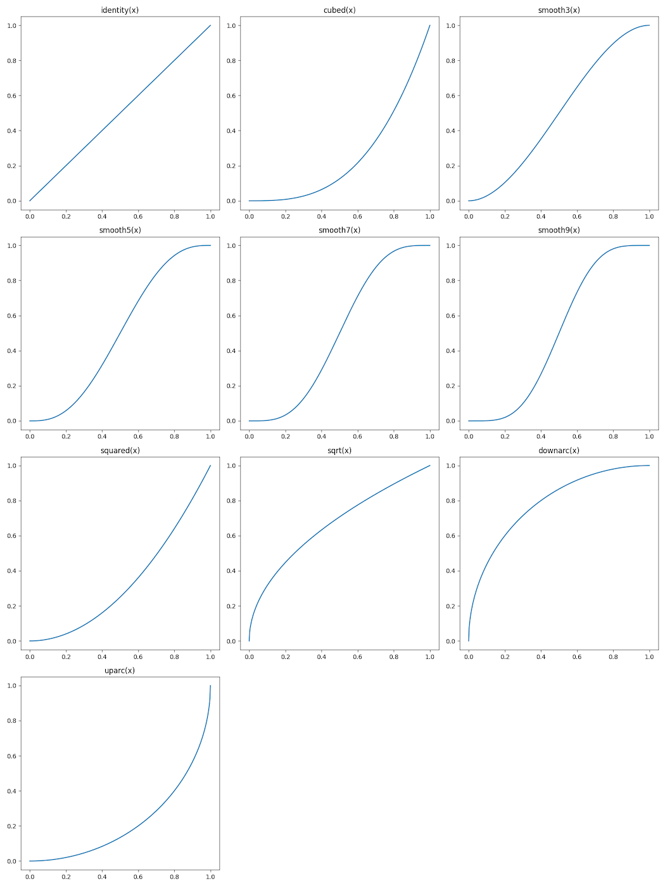
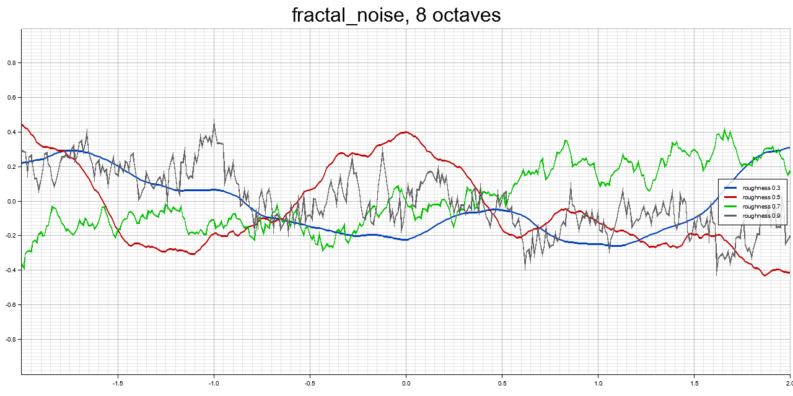
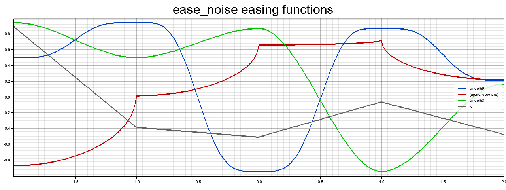
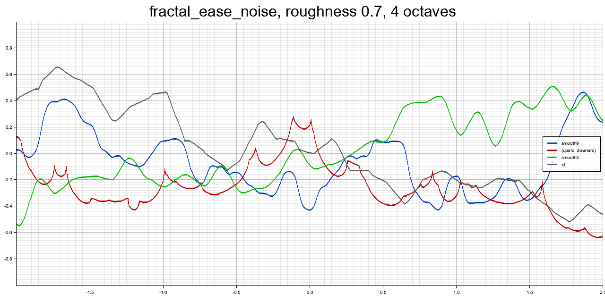

# FunDSP

[](https://github.com/SamiPerttu/fundsp/actions)
[](https://crates.io/crates/fundsp)
[](https://github.com/SamiPerttu/fundsp/README.md)

## Audio Processing and Synthesis Library for [Rust](https://www.rust-lang.org/)

[FunDSP](https://github.com/SamiPerttu/fundsp)
is an audio DSP ([digital signal processing](https://en.wikipedia.org/wiki/Digital_signal_processing))
library for audio processing and synthesis.

FunDSP features a powerful inline graph notation for describing audio processing networks.
The notation taps into composable, zero-cost abstractions that
express the structure of audio networks as [Rust](https://www.rust-lang.org/) types.

Another innovative feature of FunDSP is its signal flow system, which can
determine analytic [frequency responses](https://en.wikipedia.org/wiki/Frequency_response)
for any [linear network](https://en.wikipedia.org/wiki/Linear_filter).

FunDSP comes with a combinator environment containing
a suite of audio components, math and utility functions and
procedural generation tools.

### Uses

- Audio processing and synthesis for games and applications
- Education
- Music making
- Sound hacking and audio golfing
- Prototyping of DSP algorithms

### Rust Audio Discord

To discuss FunDSP and other topics, come hang out with us at the
[Rust Audio Discord](https://discord.gg/3hfDXS6hhQ).

### Related Projects

[bevy_fundsp](https://github.com/harudagondi/bevy_fundsp) integrates FunDSP into
the [Bevy](https://bevyengine.org/) game engine.

[bevy_procedural_audio](https://github.com/bsgbryan/bevy_procedural_audio) is a fork
of `bevy_fundsp` that is more up to date.

[bgawk](https://github.com/tomara-x/bgawk) is a sandbox for playing with physics
and sound.

[lapis](https://github.com/tomara-x/lapis) is an interpreter for FunDSP expressions.

[midi_fundsp](https://github.com/gjf2a/midi_fundsp) enables the easy creation
of live synthesizer software using FunDSP for synthesis.

[quartz](https://github.com/tomara-x/quartz)
is a visual programming and DSP playground with releases for Linux, Mac and Windows.

## Installation

Add `fundsp` to your `Cargo.toml` as a dependency.

```rust
[dependencies]
fundsp = "0.22.0"
```

The `files` feature is enabled by default. It adds support for
loading of audio files into `Wave` objects
via the [Symphonia](https://crates.io/crates/symphonia) crate.

The `fft` feature is also enabled by default.
It adds support for efficient FFT convolutions via the
[fft_convolver](https://github.com/neodsp/fft-convolver) crate.

### no_std Support

FunDSP supports `no_std` environments. To enable `no_std`, disable
the feature `std`, which is enabled by default. The `alloc` crate
is still needed for components that allocate memory.

Audio file reading and writing is not available in `no_std`.
The convolution engine is also missing in action, as it depends on `rustfft`.

```rust
[dependencies]
fundsp = { version = "0.22.0", default-features = false }
```

## Graph Notation

*FunDSP Composable Graph Notation* expresses audio networks
in algebraic form, using graph operators. It
was developed together with the functional
environment to minimize the number
of typed characters needed to accomplish common audio tasks.

Many common algorithms can be expressed in a natural form
conducive to understanding.
For example, an [FM oscillator](https://ccrma.stanford.edu/~jos/sasp/Frequency_Modulation_FM_Synthesis.html)
can be written simply (for some `f` and `m`) as:

```rust
sine_hz(f) * f * m + f >> sine()
```

The above expression defines an audio graph that is
compiled into a stack allocated, inlined form using
the powerful generic abstractions built into [Rust](https://www.rust-lang.org/).
Connectivity errors are detected during compilation, saving
development time.

### Audio DSP Becomes a First-Class Citizen

With no macros needed, the FunDSP graph notation
integrates audio DSP tightly into the [Rust programming language](https://www.rust-lang.org/)
as a first-class citizen. Native Rust operator precedences
work in harmony with the notation, minimizing 
the number of parentheses needed.

FunDSP graph expressions offer even more economy in being generic
over channel arities, which are encoded at the type level.
A mono network can be expressed
as a stereo network simply by replacing its mono generators and
filters with stereo ones, the graph notation remaining the same.

## Basics

### Component Systems

There are two parallel component systems: the static `AudioNode` and the dynamic `AudioUnit`.

---

| Trait         | Dispatch             | Allocation Strategy | Connectivity |
| ------------- | -------------------- | ------------------- | ------------ |
| `AudioNode`   | static, inlined      | stack               | input and output arity fixed at compile time |
| `AudioUnit`   | dynamic, object safe | heap                | input and output arity fixed after construction |

---

All `AudioNode` and `AudioUnit` components use 32-bit floating point samples (`f32`).

The main property of a component in either system is that it is a processing node in a graph with
a specific number of input and output connections, called its *arity*. Audio and control signals flow
through input and output connections.

Both systems operate on signals synchronously as an infinite stream. The stream can be
rewound to the start at any time using the `reset` method.

`AudioNode`s can be stack allocated for the most part.
Some nodes may use the heap for audio buffers and the like.

The `allocate` method preallocates all needed memory. It should be called last before
sending something into a real-time context. This is done automatically in
the `Net` and `Sequencer` frontends.

The purpose of the `AudioUnit` system is to grant more flexibility in dynamic situations:
decisions about input and output arities and contents can be deferred to runtime.

### Conversions

`AudioNode`s are converted to the `AudioUnit` system
using the wrapper type `An`, which implements `AudioUnit`.
Opcodes in the preludes return nodes already wrapped.

`AudioUnit`s can in turn be converted to `AudioNode` with the wrapper `unit`.
In this case, the input and output arities must be provided as type-level constants
`U0`, `U1`, ..., for example:

```rust
use fundsp::prelude32::*;
// The number of inputs is zero and the number of outputs is one.
let type_erased: An<Unit<U0, U1>> = unit::<U0, U1>(Box::new(white() >> lowpass_hz(5000.0, 1.0) >> highpass_hz(1000.0, 1.0)));
```

### Processing

Processing samples is easy in both `AudioNode` and `AudioUnit` systems.
The `tick` method is for processing single
sample frames, while the `process` method processes whole blocks.

If maximum speed is important, then
it is a good idea to use block processing, as it reduces
function calling, processing setup and dynamic network overhead,
and enables explicit [SIMD](https://en.wikipedia.org/wiki/Single_instruction,_multiple_data) support.

Mono samples can be retrieved with `get_mono` and `filter_mono` methods. The `get_mono` method
returns the next sample from a generator that has no inputs and one or two outputs,
while the `filter_mono` method filters the next sample from
a node that has one input and one output:

```rust
let out_sample = node.get_mono();
let out_sample = node.filter_mono(sample);
```

Stereo samples can be retrieved with `get_stereo` and `filter_stereo` methods.
The `get_stereo` method returns the next stereo sample pair from a generator that
has no inputs and one or two outputs,
while the `filter_stereo` method filters the next sample
from a node that has two inputs and two outputs.

```rust
let (out_left_sample, out_right_sample) = node.get_stereo();
let (out_left_sample, out_right_sample) = node.filter_stereo(left_sample, right_sample);
```

### Block Processing

The `buffer` module contains buffers for block processing.
The buffers contain 32-bit float samples. There are two types of owned
buffers: the static `BufferArray` and the dynamic `BufferVec`.

Buffers are always 64 samples long (`MAX_BUFFER_SIZE`),
have an arbitrary number of channels, and are explicitly
[SIMD](https://en.wikipedia.org/wiki/Single_instruction,_multiple_data)
accelerated with the type `f32x8` from the [`wide`](https://crates.io/crates/wide) crate.
The samples are laid out noninterleaved in a flat array.

`BufferArray` is an audio buffer backed by an array.
The number of channels is a generic parameter which must be known at compile time.
Using this buffer type it is possible to do block processing without allocating heap memory.

`BufferVec` is an audio buffer backed by a dynamic vector. The buffer is heap allocated.
The number of channels can be decided at runtime.

```rust
use fundsp::prelude64::*;
// Create a stereo buffer on the stack.
let mut buffer = BufferArray::<U2>::new();
// Declare stereo noise.
let mut node = noise() | noise();
// Process 50 samples into the buffer. There are no inputs, so we can borrow an empty buffer.
node.process(50, &BufferRef::empty(), &mut buffer.buffer_mut());
// Create another stereo buffer, this one on the heap.
let mut filtered = BufferVec::new(2);
// Declare stereo filter.
let mut filter = lowpole_hz(3000.0) | lowpole_hz(3000.0);
// Filter the 50 noise samples.
filter.process(50, &buffer.buffer_ref(), &mut filtered.buffer_mut());
```

To call `process` automatically behind the scenes, use the `BlockRateAdapter` adapter component.
However, it works only with *generators*, which are components with no inputs.

To access `f32` values in a buffer, use methods with the `f32` suffix, for example,
`at_f32` or `channel_f32`.

### Sample Rate Independence

Of the signals flowing in graphs, some contain audio while others are controls of different kinds.

With control signals and parameters in general, we prefer to use natural units like Hz and seconds.
It is useful to keep parameters independent of the sample rate, which we can then adjust as we like.

In addition to sample rate adjustments, natural units enable support for
selective oversampling (with the `oversample` component)
in nested sections that are easy to configure and modify.

Some low-level components ignore the sample rate by design, such as the single sample delay `tick`.

The default sample rate is 44.1 kHz.
In both systems, the sample rate can be set for component `A`, and any children it may have,
via `A.set_sample_rate(sample_rate)`.

## Audio Processing Environment

FunDSP preludes define convenient combinator environments for audio processing.

There are three name-level compatible versions of the prelude.

The default environment (`fundsp::prelude`) offers a generic interface.

The 64-bit prelude environment (`fundsp::prelude64`) for audio hacking
uses 64-bit internal state for components to maximize audio quality.

The 32-bit prelude environment (`fundsp::prelude32`) uses 32-bit internal
state for components. It aims to offer maximum processing speed.

An application interfacing `fundsp` can mix and match preludes as needed.
The aims of the environments are:

- Minimize the number of characters needed to type to express an idiom.
- Keep the syntax clean so that a subset of the prelude environment
  can be parsed straightforwardly as a high-level DSL for quick prototyping.
  This has been done in the [lapis](https://github.com/tomara-x/lapis) project.

- Make the syntax usable even to people with no prior exposure to programming.

## Operators

Custom operators are available for combining audio components inline.
In order of precedence, from highest to lowest:

---

| Expression     | Meaning                       | Inputs  | Outputs | Notes                                       |
| -------------- | ----------------------------- |:-------:|:-------:| ------------------------------------------- |
| `-A`           | negate `A`                    | `a`     | `a`     | Negates any number of outputs, even zero.   |
| `!A`           | thru `A`                      | `a`     | same as inputs | Passes through extra inputs. |
| `A * B`        | multiply `A` with `B`         | `a`&#160;`+`&#160;`b` | `a`&#160;`=`&#160;`b` | Aka amplification, or ring modulation when both are audio signals. Number of outputs in `A` and `B` must match. |
| `A`&#160;`*`&#160;`constant` | multiply `A`    | `a`     | `a`     | Broadcasts constant. Same applies to `constant * A`. |
| `A + B`        | sum `A` and `B`               | `a`&#160;`+`&#160;`b` | `a`&#160;`=`&#160;`b` | Aka mixing. Number of outputs in `A` and `B` must match. |
| `A`&#160;`+`&#160;`constant` | add to `A`      | `a`     | `a`     | Broadcasts constant. Same applies to `constant + A`. |
| `A - B`        | difference of `A` and `B`     | `a`&#160;`+`&#160;`b` | `a`&#160;`=`&#160;`b` | Number of outputs in `A` and `B` must match. |
| `A`&#160;`-`&#160;`constant` | subtract from `A` | `a`   | `a`     | Broadcasts constant. Same applies to `constant - A`. |
| `A >> B`       | pipe `A` to `B`               | `a`     | `b`     | Aka chaining. Number of outputs in `A` must match number of inputs in `B`. |
| `A & B`        | bus `A` and `B`               | `a`&#160;`=`&#160;`b` | `a`&#160;`=`&#160;`b` | Sum `A` and `B`. `A` and `B` must have identical connectivity. |
| `A ^ B`        | branch input to `A` and `B` in parallel | `a`&#160;`=`&#160;`b` | `a`&#160;`+`&#160;`b` | Number of inputs in `A` and `B` must match. |
| `A \| B`       | stack `A` and `B` in parallel | `a`&#160;`+`&#160;`b` | `a`&#160;`+`&#160;`b` | Concatenates `A` and `B` inputs and outputs. |

In the table, `constant` denotes an `f32` value.

All operators are associative, except the left associative `-`.

An alternative to some operators are functions available in the preludes.
Some of them have multiple combination versions;
these work only for multiples of the same type of node, with statically (at compile time) set number of nodes.

The nodes are allocated inline in all functions, as are any
inner buffers needed for block processing.

| Operator Form | Function Form   | Multiple Combination Forms |
| ------------- | --------------- | -------------------------- |
| `!A`          | `thru(A)`       | -                          |
| `A * B`       | `product(A, B)` | -                          |
| `A + B`       | `sum(A, B)`     | `sumi, sumf`               |
| `A >> B`      | `pipe(A, B)`    | `pipei, pipef`             |
| `A & B`       | `bus(A, B)`     | `busi, busf`               |
| `A ^ B`       | `branch(A, B)`  | `branchi, branchf`         |
| `A \| B`      | `stack(A, B)`   | `stacki, stackf`           |

---

### Operators Diagram


Each cyan dot in the diagram above can contain an arbitrary number of channels, including zero.

In the `AudioNode` system the number of channels is determined statically, at compile time,
while in the `AudioUnit` system (using `Net`) the number of channels can be
decided at runtime.

### Broadcasting

Arithmetic operators are applied to outputs channelwise.

Arithmetic between two components never broadcasts channels: channel arities have to match always.

Direct arithmetic with `f32` values, however, broadcasts to an arbitrary number of channels.

The negation operator broadcasts also: `-A` is equivalent with `(0.0 - A)`.

For example, `A * constant(2.0)` and `A >> mul(2.0)` are equivalent and expect `A` to have one output.
On the other hand, `A * 2.0` works with any `A`, even with zero outputs.

### Thru

The thru (`!`) operator is syntactic sugar for chaining filters with similar connectivity.

It adjusts output arity to match input arity and passes through any missing outputs to the next node.
The missing outputs are parameters to the filter.

For example, while `lowpass()` is a 2nd order lowpass filter, `!lowpass() >> lowpass()`
is a steeper 4th order lowpass filter with identical connectivity.

The thru operator is also available as a function: `thru(A)` is equivalent with `!A`.

### Generators, Filters and Sinks

Components can be broadly classified into generators, filters and sinks.
*Generators* have only outputs, while *filters* have both inputs and outputs.

Sinks are components with no outputs. Direct arithmetic on a sink translates to a no-op.
In the preludes, `sink()` returns a mono sink.

### Graph Combinators

Of special interest among operators are the four custom combinators:
*pipe* ( `>>` ), *bus* ( `&` ), *branch* ( `^` ),  and *stack* ( `|` ).

The pipe is a serial operator where components appear in *processing* order. Branch, stack, and
arithmetic operators are parallel operators where components appear in *channel* order.

The bus is a commutative operator where components may appear in any order.
The other operators are not commutative in general.

All four are fully associative, and
each come with their own connectivity rules.

#### Pipe

The pipe ( `>>` ) operator builds traditional processing chains akin to composition of functions.
`A` runs first, then `B`. In `A >> B`, each output of `A` is piped to a matching input of `B`, so
the output arity of `A` must match the input arity of `B`.

The whole combination then has the input arity of `A` and the output arity of `B`.
Pipe is a fundamental operation. It wires units in series.

The pipe operation is also available as a function: `pipe(A, B)` is equal to `A >> B`.

#### Branch

Where the arithmetic operators are reducing in nature,
the branch ( `^` ) operator splits a signal into parallel branches.

In `A ^ B`, both components receive the same input but their outputs are disjoint.
Because the components receive the same input, the number of inputs in `A` and `B` must match.
In `A ^ B`, the outputs of `A` appear first, followed with outputs of `B`.

Branching is useful for building *banks* of components such as filters.

The branch operation is also available as a function: `branch(A, B)` is equal to `A ^ B`.

#### Bus

The bus ( `&` ) operator can be thought of as an inline [audio bus](https://en.wikipedia.org/wiki/Audio_bus)
with a fixed set of input and output channels.
It builds signal buses from components with identical connectivity.

In `A & B`, the same input is sent to both `A` and `B`, and their outputs are mixed together.
Components in a bus may appear in any order.

The bus is especially useful because it does not alter connectivity:
we can always bus together any set of matching components
without touching the rest of the expression.

Both `A + B` and `A & B` are mixing operators. The difference between the two is that `A + B` is reducing:
`A` and `B` have their own, disjoint inputs, which are combined at the output.
In `A & B`, both components source from the same inputs, and the number of inputs must match.

One application of the bus is controlling effect mix in conjunction with the `pass` opcode,
which passes signal through unchanged. For example, to add 20% chorus to a mono signal,
one might type `pass() & 0.2 * chorus(0, 0.0, 0.01, 0.3)`.

Or, to add 20% reverb to a stereo signal, `multipass() & 0.2 * reverb_stereo(20.0, 2.0, 1.0)`.
Type inference works in our favor here, saving us the need to write the arity of `multipass`,
and the constant `0.2` is broadcast to two channels.

The bus operation is also available as a function: `bus(A, B)` is equal to `A & B`.

#### Stack

The stack ( `|` ) operator builds composite components.
It can be applied to any two components.

As a graph operator, the stack corresponds to the *disjoint union*.
In `A | B`, the inputs and outputs of `A` and `B`
are disjoint and they are processed independently, in parallel.

In stacks, components are written in channel order.
In `A | B | C`, channels of `A` come first, followed by channels of `B`, then `C`.

The stack is often used to build filter parameters. For example, in
`(pass() | constant((440.0, 1.0))) >> lowpass()` the input signal is passed through
the stack and two other signals, frequency and Q, are concatenated to it to form the input
to a lowpass filter.

The stack operation is also available as a function: `stack(A, B)` is equal to `A | B`.

## Expressions Are Graphs

The expression `A >> (B ^ C ^ D)` defines a signal processing graph.
It has whatever inputs `A` has, and outputs everything from `B` and `C` and `D` in parallel.

The whole structure is packed, monomorphized and inlined with the constituent nodes consumed.
If you want to reuse components, define them as functions or closures, or clone them.
See the preludes for examples.

Connectivity is checked during compilation.
Mismatched connectivity will result in a compilation error complaining about mismatched
[`typenum`](https://crates.io/crates/typenum) [types](https://docs.rs/typenum/1.12.0/typenum/uint/struct.UInt.html).
The arrays `Frame<f32, Size>` that connect components in `tick` come from the
[`generic-array`](https://crates.io/crates/generic-array) and
[`numeric-array`](https://crates.io/crates/numeric-array) crates.

### Computational Structure

Graph combinators consume their arguments.
This prevents cycles and imposes an overall tree shape on the resulting computation graph.

Implicit cycle prevention means that the built structures are always computationally efficient
in the dataflow sense. All reuse of computed data takes place locally, inside combinators and components.

There are two main ways to structure the reuse of signals in FunDSP graph notation:
branching and busing. Both are exposed as fundamental operators,
guiding toward efficient structuring of computation.
Dataflow concerns are thus explicated in the graph notation itself.

### Net

The graph notation can get cumbersome for complex graphs. Also, sometimes
the number of inputs and outputs is not known until runtime.

The `Net` component offers an explicit graph interface
for connecting `AudioUnit` nodes.
Arity of the net is specified as constructor arguments.

For example, to build `dc(220.0) >> sine()` dynamically using `Net`:

```rust
use fundsp::prelude64::*;
// Instantiate network with 0 inputs and 1 output.
let mut net = Net::new(0, 1);
// Add nodes, obtaining their IDs.
let dc_id = net.push(Box::new(dc(220.0)));
let sine_id = net.push(Box::new(sine()));
// Connect nodes.
net.pipe_all(dc_id, sine_id);
net.pipe_output(sine_id);
```

The overhead of `Net` is the overhead of calling into `Box<dyn AudioUnit>`
objects. Static graphs can get optimized more effectively as well by the compiler.
Beyond that, the dynamic versions are roughly as efficient
as the static ones.

The graph syntax is also available for combining `Net` instances.
Connectivity checks are then deferred to runtime.

Networks can also be combined inline with components from the preludes.
The components are first converted to `Net`.

When we need dynamic processing, we can start it with `Net::wrap`,
which converts any unit into a network. Moreover, we can control when
to cross from the static realm into the dynamic by the placement of `Net::wrap`.

```rust
use fundsp::prelude64::*;
// Wrap saw wave in a network.
let mut net = Net::wrap(Box::new(saw()));
// Now we can add filters conditionally.
let add_filter = true;
if add_filter {
    net = net >> lowpass_hz(1000.0, 1.0);
}
```

For real-time situations, a `Net` can be divided into a frontend
and a backend. The frontend handles changes to the network,
while the real-time safe backend renders audio.

```rust
use fundsp::prelude64::*;
let mut net = Net::new(0, 1);
let noise_id = net.chain(Box::new(pink()));
// Create the backend.
let mut backend = net.backend();
// The backend is now ready to be sent into an audio thread.
// We can make changes to the frontend and then commit them to the backend.
net.replace(noise_id, Box::new(brown()));
net.commit();
// We can also use the graph syntax to make changes, as long as connectivity
// is maintained at commit time.
net = net >> peak_hz(1000.0, 1.0);
net.commit();
/// Nodes can be replaced smoothly with a crossfade to avoid clicks.
net.crossfade(noise_id, Fade::Smooth, 1.0, Box::new(white()));
net.commit();
```

Using dynamic networks incurs some overhead so it is an especially good idea
to use block processing, which neutralizes it effectively.

It is possible to create cycles with `Net` methods.
If that happens an error is raised, which can be checked with `Net::error`.
If the cycle is removed, the error is cleared.
All nodes get processed anyway.

### Sequencer

The `Sequencer` component mixes together nodes dynamically.
It can start and stop rendering nodes with sample accuracy.

The sequencer has a user specified number of inputs and outputs.

```rust
use fundsp::prelude64::*;
// Create stereo sequencer.
// The third argument should be set to `ReplayMode::All` if we want to replay events after `reset`.
let mut sequencer = Sequencer::new(0, 2, ReplayMode::None);
```

Adding new events, their start and stop times as well as fade-in and fade-out envelopes
can be set. The sequencer returns an `EventId` that can be used for later edits to the event.

```rust
// Add a new event with start time 1.0 seconds and end time 2.0 seconds.
// Fade-in time is 0.1 seconds, while the fade-out time is 0.2 seconds.
// This returns an `EventId`.
let id1 = sequencer.push(1.0, 2.0, Fade::Smooth, 0.1, 0.2, Box::new(noise() | noise()));
// Add a new event that starts immediately and plays indefinitely.
let id2 = sequencer.push_relative(0.0, f64::INFINITY, Fade::Smooth, 0.1, 0.2, Box::new(pink() | pink()));
```

For use as a dynamic mixer, the sequencer can be split into a frontend and a backend.
The frontend is for adding and editing events, and the real-time safe backend renders audio.

```rust
// Get a backend for this sequencer. This sequencer is then the frontend.
let mut backend = sequencer.backend();
// Now we can insert the backend into, for example, a `Net`.
// Later we can use the frontend to create events and make edits to them; the end time and fade-out time
// can be changed. Here we start fading out the event immediately with an envelope duration of 0.1 seconds.
sequencer.edit_relative(id2, 0.0, 0.1);
```

## Input Modalities And Ranges

Some signals found flowing in audio networks.

| Modality       | Preferred Units/Range  | Notes                                      |
| -------------- | ---------------------- | ------------------------------------------ |
| frequency      | Hz                     | |
| phase          | 0...1                  | All oscillators use this range. |
| time           | s                      | |
| audio data     | -1...1                 | Inner processing may use any range that is convenient. However, only special output formats can store audio data outside this range. |
| stereo pan     | -1...1 (left to right) | For ergonomy, consider clamping any pan input to this range. |
| pulse width    | 0...1                  | |
| control amount | 0...1                  | If there is no natural interpretation of the parameter. |

## Deterministic Pseudorandom Phase

FunDSP uses a deterministic pseudorandom phase system for audio generators.
Generator phases are seeded from network structure and node location.

Thus, two identical networks sound identical separately but different when combined.
This means that `noise() | noise()` is a stereo noise source, for example.

Pseudorandom phase is an attempt to decorrelate different channels of audio.
It is also used to pick sample points for envelopes, contributing to a "warmer" sound.

To override pseudorandom phase in a noise component (`brown`, `mls`, `mls_bits`, `noise`, `pink` and `white` opcodes),
use the `seed` builder method. For example, `noise().seed(1)`.

### Oscillators

To override pseudorandom phase in an oscillator with an initial phase of your own (in 0...1),
use the `phase` builder method. For example, in `let mut A = sine_hz(220.0).phase(0.0)`
the (220 Hz) sine wave starts from zero phase (where the value is zero, too).

To change the initial phase later, use the `phase` setting, for example,
`A.set(Setting::phase(0.5))`. The setting takes effect during the next reset.

The following table lists the oscillator opcodes.

| Opcode         | Type                   | Waveform                                   |
| -------------- | ---------------------- | ------------------------------------------ |
| `dsf_saw`      | DSF                    | [saw](https://en.wikipedia.org/wiki/Sawtooth_wave)-like
| `dsf_square`   | DSF                    | [square](https://en.wikipedia.org/wiki/Square_wave)-like
| `hammond`      | wavetable              | Hammond-y waveform, which emphasizes first three partials |
| `organ`        | wavetable              | organ-y waveform, which emphasizes octave partials |
| `poly_pulse`   | PolyBLEP               | [pulse](https://en.wikipedia.org/wiki/Pulse_wave) |
| `poly_saw`     | PolyBLEP               | saw |
| `poly_square`  | PolyBLEP               | square |
| `pulse`        | wavetable              | pulse |
| `saw`          | wavetable              | saw |
| `sine`         | sine                   | [sine](https://en.wikipedia.org/wiki/Sine_wave) |
| `soft_saw`     | wavetable              | soft saw, which falls off like a triangle wave |
| `square`       | wavetable              | square |
| `triangle`     | wavetable              | [triangle](https://en.wikipedia.org/wiki/Triangle_wave) |

The wavetable oscillator is [bandlimited](https://en.wikipedia.org/wiki/Bandlimiting)
with pristine quality.
However, unlike the other types it allocates memory in the form of global wavetables.
The [DSF](https://ccrma.stanford.edu/files/papers/stanm5.pdf) oscillator has similar quality but is somewhat expensive to evaluate.
The PolyBLEP oscillator is a fast approximation with fair quality.

## Working With Waves

FunDSP includes a multichannel wave abstraction called `Wave`.
For example, to render 10 seconds of pink noise:

```rust
use fundsp::prelude64::*;
let wave1 = Wave::render(44100.0, 10.0, &mut (pink()));
```

Then filter it with a moving bandpass filter and normalize samples to -1..1:

```rust
let mut wave2 = wave1.filter(10.0, &mut ((pass() | lfo(|t| (xerp11(110.0, 880.0, spline_noise(0, t * 5.0)), 1.0))) >> bandpass()));
wave2.normalize();
```

Saving of waves is possible in 16-bit or 32-bit [WAV](https://en.wikipedia.org/wiki/WAV)
when the `std` feature is enabled.
The 16-bit format is integer based while the 32-bit format is floating point.

For example, to save `wave2` to `test.wav`:

```rust
wave2.save_wav16("test.wav").expect("Could not save wave.");
```

Loading of audio files in various formats is handled by the
[Symphonia](https://crates.io/crates/symphonia) crate.
Symphonia integration is enabled by the `files` feature, which is enabled by default.
The `std` feature must be enabled also.

For example, to load `test.wav`:

```rust
let wave3 = Wave::load("test.wav").expect("Could not load wave.");
```

Individual channels of waves can be played back with the `playwave` and `playwave_at` opcodes.

Waves can be resampled with the `resample_fir` method that employs the [`resampler`](https://github.com/hasenbanck/resampler)
crate for FIR based sinc resampling. It accepts these source and target rates:
16 kHz, 22.05 kHz, 32 kHz, 44.1 kHz, 48 kHz, 88.2 kHz, 96 kHz, 176.4 kHz, 192 kHz, and 384 kHz.

## Signal Flow Analysis

FunDSP features a comprehensive signal flow system that analyzes
causal latencies and frequency responses in audio networks.

The system can calculate the [frequency response](https://en.wikipedia.org/wiki/Frequency_response)
of any *[linear network](https://en.wikipedia.org/wiki/Linear_filter)*
analytically by composing [transfer functions](https://en.wikipedia.org/wiki/Transfer_function#Linear_time-invariant_systems)
and folding constants. Linear networks are constructed from linear filters, delays, and the operations of:

* Mixing.
* Chaining. Chaining of linear filters and delays maintains linearity.
* Constant scaling. Signals may be scaled by constant factors.

Signal latencies are similarly analyzed from input to output in detail,
facilitating automatic removal of pre-delay from effects chains.
The definition of latency is one of involuntary causal kind, so
voluntarily placed delay elements do not count as latency.

For example,
[FIR](https://en.wikipedia.org/wiki/Finite_impulse_response) filters
can be composed inline from single sample delays (the `tick` opcode) and arithmetic.
Signal flow analysis will readily reveal that a 2-point averaging filter
has zero gain at the [Nyquist](https://en.wikipedia.org/wiki/Nyquist_frequency) frequency,
while a 3-point averaging filter does not:

```rust
use fundsp::prelude64::*;
assert!((pass() & tick()).response(0, 22050.0).unwrap().norm() < 1.0e-9);
assert!((pass() & tick() & tick() >> tick()).response(0, 22050.0).unwrap().norm() > 0.1);
```

However, with appropriate scaling a 3-point FIR can vanish, too:

```rust
use fundsp::prelude64::*;
assert!((0.5 * pass() & tick() & 0.5 * tick() >> tick()).response(0, 22050.0).unwrap().norm() < 1.0e-9);
```

## Filters

### List of Linear Filters

Verified frequency responses are available for all linear filters.

---

| Opcode       | Type                   | Parameters   | Family       | Notes     |
| ------------ | ---------------------- | ------------ | ------------ | --------- |
| `allpass`    | allpass (2nd order)    | frequency, Q | [Simper SVF](https://cytomic.com/files/dsp/SvfLinearTrapOptimised2.pdf) | |
| `allpole`    | allpass (1st order)    | delay        | 1st order | Adjustable delay at DC in samples. |
| `bandpass`   | bandpass (2nd order)   | frequency, Q | Simper SVF   | |
| `bell`       | peaking (2nd order)    | frequency, Q, gain | Simper SVF | Adjustable amplitude gain. |
| `biquad`     | biquad (2nd order)     | -            | [biquad](https://en.wikipedia.org/wiki/Digital_biquad_filter) | Arbitrary biquad with fixed parameters. |
| `butterpass` | lowpass (2nd order)    | frequency    | biquad | [Butterworth](https://en.wikipedia.org/wiki/Butterworth_filter) lowpass has a maximally flat passband and monotonic frequency response. |
| `dcblock`    | DC blocker (1st order) | frequency    | 1st order    | Zero centers signal, countering any constant offset ("direct current"). |
| `fir`        | FIR                    | -            | [FIR](https://en.wikipedia.org/wiki/Finite_impulse_response) | |
| `follow`     | lowpass (3rd order)    | response time | nested 1st order | Smoothing filter with adjustable edge response time. |
| `highpass`   | highpass (2nd order)   | frequency, Q | Simper SVF   | |
| `highpole`   | highpass (1st order)   | frequency    | 1st order    | |
| `highshelf`  | high shelf (2nd order) | frequency, Q, gain | Simper SVF | Adjustable amplitude gain. |
| `lowpass`    | lowpass (2nd order)    | frequency, Q | Simper SVF   | |
| `lowpole`    | lowpass (1st order)    | frequency    | 1st order    | |
| `lowshelf`   | low shelf (2nd order)  | frequency, Q, gain | Simper SVF | Adjustable amplitude gain. |
| `morph`      | morphing (2nd order)   | frequency, Q, morph | Simper SVF | Morphs between lowpass, peaking and highpass modes. |
| `notch`      | notch (2nd order)      | frequency, Q | Simper SVF   | |
| `peak`       | peaking (2nd order)    | frequency, Q | Simper SVF   | |
| `pinkpass`   | lowpass (3 dB/octave)  | -            | mixed FIR / 1st order | Turns white noise into pink noise. |
| `resonator`  | bandpass (2nd order)   | frequency, Q | biquad | Gain stays constant as Q is varied. |

### Parameter Smoothing Filter

The `follow` filter is special. It supports different rates for rising (attack) and falling (release) segments.
For example, `afollow(0.1, 0.2)` has a 0.1 second attack and a 0.2 second release.

It also jumps immediately to the very first value in the input stream, and starts smoothing from there.
This means the output value is always within input bounds.

### List of Nonlinear Filters

Unlike linear filters, nonlinear filters are sensitive to incoming signal level.
Due to nonlinearity, we do not attempt to calculate frequency responses for these filters.

---

| Opcode       | Type                   | Parameters   | Family       | Notes     |
| ------------ | ---------------------- | ------------ | ------------ | --------- |
| `bandrez`    | bandpass (2nd order)   | frequency, Q | nested 1st order |  |
| `dbell`      | peaking (2nd order)    | frequency, Q, gain | [dirty biquad](https://jatinchowdhury18.medium.com/complex-nonlinearities-episode-4-nonlinear-biquad-filters-ae6b3f23cb0e) | Biquad with nonlinear state shaping and adjustable amplitude gain. |
| `dhighpass`  | highpass (2nd order)   | frequency, Q | dirty biquad | |
| `dlowpass`   | lowpass (2nd order)    | frequency, Q | dirty biquad | |
| `dresonator` | bandpass (2nd order)   | frequency, Q | dirty biquad | |
| `fbell`      | peaking (2nd order)    | frequency, Q, gain | [feedback biquad](https://jatinchowdhury18.medium.com/complex-nonlinearities-episode-5-nonlinear-feedback-filters-115e65fc0402) | Biquad with nonlinear feedback and adjustable amplitude gain. |
| `fhighpass`  | highpass (2nd order)   | frequency, Q | feedback biquad | |
| `flowpass`   | lowpass (2nd order)    | frequency, Q | feedback biquad | |
| `fresonator` | bandpass (2nd order)   | frequency, Q | feedback biquad | |
| `lowrez`     | lowpass (2nd order)    | frequency, Q | nested 1st order | |
| `moog`       | lowpass (4th order)    | frequency, Q | Moog ladder  | |

---

### Frequency Domain Resynthesis

Filtering and other effects can be done in the
[frequency domain](https://en.wikipedia.org/wiki/Frequency_domain)
as well with the `resynth` opcode.

The resynthesizer
[Fourier transforms](https://en.wikipedia.org/wiki/Discrete-time_Fourier_transform)
input windows to the frequency domain with an overlap of four.
A processing function then translates these inputs to frequency domain
outputs. The output windows are inverse transformed and overlap-added.

The resynthesizer can reconstruct inputs exactly, so an effect can
be made to vary smoothly between an input and a processed version.

For example, to implement a highly selective
[FFT](https://en.wikipedia.org/wiki/Fast_Fourier_transform) 
bandpass filter:

```rust
use fundsp::prelude32::*;

// The window length, which must be a power of two and at least four,
// determines the frequency resolution. Latency is equal to the window length.
let window_length = 1024;

// Passband in Hz.
let pass_min = 1000.0;
let pass_max = 2000.0;

// The number of input and output channels is user configurable.
// Here both are 1 (`U1`).
let synth = resynth::<U1, U1, _>(window_length, |fft|
    for i in 0..fft.bins() {
        if fft.frequency(i) >= pass_min && fft.frequency(i) <= pass_max {
            fft.set(0, i, fft.at(0, i));
        }
    });
```

The processing function can obtain window time from the supplied FFT window
object, to support time varying effects.

For more information on the technique, see
[Fourier analysis and reconstruction of audio signals](http://msp.ucsd.edu/techniques/v0.11/book-html/node172.html).

## More On Multithreading And Real-Time Control

Besides `Net` and `Sequencer` frontends, there are two ways to introduce real-time
control to graph expressions: shared atomic variables and setting listeners.

### Atomic Variables

We may use shared atomic variables to communicate data from and to external contexts.
A shared variable is declared with an initial value:

```rust
use fundsp::prelude64::*;
let amp = shared(1.0);
```

Shared variables can be cloned and sent into another thread.
To instantiate a shared variable output into an audio graph, use `var` and `var_fn` opcodes.
For example, to control amplitude:

```rust
let amp_controlled = noise() * var(&amp);
```

Later we can set the amplitude from anywhere:

```rust
amp.set_value(0.5);
```

A useful pattern is piping a shared variable through a `follow` filter
to smooth parameter changes, here with a 0.1 second response time:

```rust
let amp_controlled = noise() * (var(&amp) >> follow(0.1));
```

The `timer` opcode maintains stream time in a shared variable.
The timer node has no inputs or outputs and can be joined to any node by stacking.

### Settings

Settings are all kinds of node parameters with no dedicated inputs.
A node can respond to one or more types of settings, which are
applied using the `set` method.

```rust
use fundsp::prelude64::*;
let mut node = afollow(0.1, 1.0);
node.set(Setting::attack_release(0.2, 2.0));
```

To adjust settings from other threads, a node can be
wrapped inside a setting listener with the `listen(node)`
opcode. It returns a `(sender, node)` pair.

The sender can be cloned and invoked from other threads.
The format of settings available through `sender` depends
on the type of the graph.

Nodes inside structures can be accessed via addressing:

| `Setting` Call | Address Meaning |
| -------------- | --------------------------------- |
| `left()`       | Pick left side of binary operation. |
| `right()`      | Pick right side of binary operation. |
| `index(i)`     | Pick index `i` inside structure such as `busi`. |
| `node(id)`     | Pick node with `id` inside `Net`. |

Addresses are specified after the parameter constructor.
They can be nested up to four levels deep.

If a listener is attached to a binary operation, then the
different sides can be picked with the `left` or `right` method.
For example, constants are exposed as scalar settings:

```rust
use fundsp::prelude64::*;
let (sender, node) = listen(dc(0.5) >> resample(pink()));
sender.try_send(Setting::value(0.6).left()).expect("Cannot send setting.");
```

If a parameter has a dedicated input then it cannot be a setting.
The way to get filters with parameters controlled via settings
is to use the forms that specify all parameters
as constant, for example, `lowpass_hz`.

```rust
use fundsp::prelude64::*;
let (sender, node) = listen(lowpass_hz(1000.0, 1.0));
```

Later we can send filter parameters from anywhere via `sender`.
For example, the lowpass filter supports setting cutoff frequency and Q value.
Set filter cutoff to 2 kHz and Q to 2.0:

```rust
sender.try_send(Setting::center_q(2000.0, 2.0)).expect("Cannot send setting.");
```

The following table summarizes the available settings.

| Opcode            | `Setting` Constructor Call |
| ----------------- | --------------------------------- |
| `afollow`         | `attack_release` to set attack and release times in seconds |
| `allnest_c`       | `delay` in samples at DC |
| `allpass_hz`      | `center_q` |
| `allpole_delay`   | `delay` in samples at DC |
| `bandpass_hz`     | `center_q` |
| `bell_hz`         | `center_q_gain` |
| `biquad`          | `biquad` to set biquad coefficients |
| `biquad_bank`     | `biquad(a1, a2, b0, b1, b2).index(i)` to set channel `i` coefficients |
| `butterpass_hz`   | `center` |
| `constant`        | `value` to set scalar value on all channels |
| `dbell_hz`        | `center_q_gain` |
| `dc`              | `value` to set scalar value on all channels |
| `dcblock_hz`      | `center` |
| `dhighpass_hz`    | `center_q` |
| `dlowpass_hz`     | `center_q` |
| `dresonator_hz`   | `center_q` |
| `dsf_saw_r`       | `roughness` in 0...1 |
| `dsf_square_r`    | `roughness` in 0...1 |
| `fbell_hz`        | `center_q_gain` |
| `fhighpass_hz`    | `center_q` |
| `flowpass_hz`     | `center_q` |
| `follow`          | `time` to set follow time in seconds |
| `fresonator_hz`   | `center_q` |
| `highpass_hz`     | `center_q` |
| `highpole_hz`     | `center` |
| `highshelf_hz`    | `center_q_gain` |
| `hold`            | `variability` in 0...1 |
| `lowpass_hz`      | `center_q` |
| `lowpole_hz`      | `center` |
| `lowshelf_hz`     | `center_q_gain` |
| `moog_hz`         | `center_q` |
| `notch_hz`        | `center_q` |
| `pan`             | `pan` to set pan value in -1...1 |
| `peak_hz`         | `center_q` |
| `resonator_hz`    | `center_q` |

If a node responds to `center_q_gain`, then it also responds to `center_q` and `center`.
If a node responds to `center_q`, then it also responds to `center`.

---

## Parametric Equalizer Recipe

In this example we make a 12-band, double precision parametric equalizer
using the peaking `bell` filter.
The sample type, as always, is 32-bit floating point (`f32`).

First, declare the processing pipeline.
Here we space the bands at 1 kHz increments starting from 1 kHz, set Q values to 1.0
and set gains of all bands to 0 dB initially:

```rust
use fundsp::prelude64::*;
let mut equalizer = pipei::<U12, _, _>(|i| bell_hz(1000.0 + 1000.0 * i as f32, 1.0, db_amp(0.0)));
```

The type of the equalizer is `An<Chain<U12, FixedSvf<f64, BellMode<f64>>>>`.
The equalizer is ready to use immediately. Filter samples:

```rust
let output_sample = equalizer.filter_mono(input_sample);
```

We can access individual bands via `equalizer.node(i)` and `equalizer.node_mut(i)`
where `i` ranges from 0 to 11.
Set band 0 to amplify by 10 dB at 500 Hz with Q set to 2.0:

```rust
equalizer.node_mut(0).set_gain(db_amp(10.0));
equalizer.node_mut(0).set_center(500.0);
equalizer.node_mut(0).set_q(2.0);
```

For plotting the frequency response, we can query the equalizer.
Query equalizer gain at 1 kHz:

```rust
let decibel_gain_at_1k = equalizer.response_db(0, 1000.0).unwrap();
```

The default sample rate is 44.1 kHz. Set sample rate to 48 kHz:

```rust
equalizer.set_sample_rate(48_000.0);
```

For real-time control, the equalizer can be equipped with
a setting listener.

```rust
let (sender, equalizer) = listen(equalizer);
```

Then, we can send settings to change center frequency, Q and gain.
The settings are available because we constructed the filter using
the `bell_hz` form.
Set band 1 to amplify by 3 dB at 1000 Hz with Q set to 2.0:

```rust
sender.try_send(Setting::center_q_gain(1000.0, 2.0, db_amp(3.0)).index(1)).expect("Cannot send setting.");
```

## evcxr

The `display` method returns information about a node,
including an ASCII chart of the frequency response of channel 0.

Here is an example of using [`evcxr`](https://github.com/google/evcxr)
to examine frequency responses interactively:

```rust
C:\rust>evcxr
Welcome to evcxr. For help, type :help
>> :dep fundsp
>> use fundsp::prelude64::*;
>> print!("{}", bell_hz(1000.0, 1.0, db_amp(50.0)).display())
 60 dB ------------------------------------------------  60 dB
 
 50 dB -------------------------.----------------------  50 dB
                                *
 40 dB -------------------------*----------------------  40 dB
                               ** 
 30 dB -----------------------.***---------------------  30 dB
                             ******.
 20 dB -------------------..*********.-----------------  20 dB
                       ..**************.
 10 dB -------------..********************..-----------  10 dB
               ..*****************************...
  0 dB ....***************************************.....   0 dB
       |   |    |    |     |    |    |     |    |    |
       10  50   100  200   500  1k   2k    5k   10k  20k Hz

Peak Magnitude : 50.00 dB (1000 Hz)
Inputs         : 1
Outputs        : 1
Latency        : 0.0 samples
Footprint      : 96 bytes

>>
```

## Free Functions

These free functions are available in the environment.

---

### Component Opcodes

The type parameters in the table refer to the `prelude32` and `prelude64` preludes.

`I`, `M`, `N`, `O`, `U` are type-level integers. They are `U0`, `U1`, `U2`...

---

| Function               | Inputs  | Outputs | Explanation                                    |
| ---------------------- |:-------:|:-------:| ---------------------------------------------- |
| `add(x)`               |   `x`   |   `x`   | Add constant `x` to signal. |
| `adsr_live(a, d, s, r)`|    1    |    1    | ADSR envelope. Attack time `a`, decay time `d`, sustain level `s`, and release time `r`. Input > 0.0 starts attack, input <= 0.0 starts release. Output in [0.0, 1.0].|
| `afollow(a, r)`        |    1    |    1    | Asymmetric smoothing filter with halfway attack time `a` seconds and halfway release time `r` seconds. |
| `allnest(x)`           | 2 (input, coefficient) | 1 | Nested allpass with inner allpass processing `x`. |
| `allnest_c(c, x)`      |    1    |    1    | Nested allpass with feedforward coefficient `c` and inner allpass processing `x`. |
| `allpass()`            | 3 (audio, frequency, Q) | 1 | Allpass filter (2nd order). |
| `allpass_hz(f, q)`     |    1    |    1    | Allpass filter (2nd order) centered at `f` Hz with Q `q`. |
| `allpass_q(q)`         | 2 (audio, frequency) | 1 | Allpass filter (2nd order) with Q `q`. |
| `allpole()`            | 2 (audio, delay) | 1 | Allpass filter (1st order). 2nd input is delay in samples (`delay` > 0). |
| `allpole_delay(delay)` |    1    |    1    | Allpass filter (1st order) with `delay` at DC in samples (`delay` > 0). |
| `bandpass()`           | 3 (audio, frequency, Q) | 1 | Bandpass filter (2nd order). |
| `bandpass_hz(f, q)`    |    1    |    1    | Bandpass filter (2nd order) centered at `f` Hz with Q `q`. |
| `bandpass_q(q)`        | 2 (audio, frequency) | 1 | Bandpass filter (2nd order) with Q `q`. |
| `bandrez()`            | 3 (audio, frequency, Q) | 1 | Resonant bandpass filter (2nd order). |
| `bandrez_hz(f, q)`     |    1    |    1    | Resonant bandpass filter (2nd order) centered at `f` Hz with resonance `q` in 0...1. |
| `bandrez_q(q)`         | 2 (audio, frequency) | 1 | Resonant bandpass filter (2nd order) with resonance `q` in 0...1. |
| `bell()`               | 4 (audio, frequency, Q, gain) | 1 | Peaking filter (2nd order) with adjustable amplitude gain. |
| `bell_hz(f, q, gain)`  |    1    |    1    | Peaking filter (2nd order) centered at `f` Hz with Q `q` and amplitude gain `gain`. |
| `bell_q(q, gain)`      | 2 (audio, frequency) | 1 | Peaking filter (2nd order) with Q `q` and amplitude gain `gain`. |
| `biquad(a1, a2, b0, b1, b2)` | 1 |    1    | Arbitrary [biquad filter](https://en.wikipedia.org/wiki/Digital_biquad_filter) with coefficients in normalized form. |
| `biquad_bank()`        |   4/8   |   4/8   | Bank of SIMD accelerated biquad filters with 4 channels in double precision or 8 channels in single precision. |
| `brown()`              |    -    |    1    | [Brown](https://en.wikipedia.org/wiki/Brownian_noise) noise. |
| `branch(x, y)`         | `x = y` | `x + y` | Branch into `x` and `y`. Identical with `x ^ y`. |
| `branchf::<U, _, _>(f)`|   `f`   | `U * f` | Branch into `U` nodes from fractional generator `f`, e.g., `\| x \| resonator_hz(xerp(20.0, 20_000.0, x), xerp(5.0, 5_000.0, x))`. |
| `branchi::<U, _, _>(f)`|   `f`   | `U * f` | Branch into `U` nodes from indexed generator `f`. |
| `bus(x, y)`            | `x = y` | `x = y` | Bus `x` and `y`. Identical with `x & y`. |
| `busf::<U, _, _>(f)`   |   `f`   |   `f`   | Bus together `U` nodes from fractional generator `f`. |
| `busi::<U, _, _>(f)`   |   `f`   |   `f`   | Bus together `U` nodes from indexed generator `f`, e.g., `\| i \| mul(i as f32 + 1.0) >> sine()`. |
| `butterpass()`         | 2 (audio, frequency) | 1 | Butterworth lowpass filter (2nd order). |
| `butterpass_hz(f)`     |    1    |    1    | Butterworth lowpass filter (2nd order) with cutoff frequency `f` Hz. |
| `chorus(seed, sep, var, mod)` | 1 | 1 | Chorus effect with LFO seed `seed`, voice separation `sep` seconds, delay variation `var` seconds and LFO modulation frequency `mod` Hz. |
| `clip()`               |    1    |    1    | Clip signal to -1...1. |
| `clip_to(min, max)`    |    1    |    1    | Clip signal to min...max. |
| `constant(x)`          |    -    |   `x`   | Constant signal `x`. Synonymous with `dc`. |
| `convolve(&wave, channel)` | 1   |    1    | Convolve input with the given response. |
| `dbell(shape)`         | 4 (audio, frequency, Q, gain) | 1 | Dirty biquad bell equalizer (2nd order) with feedback `shape`, for example, `Tanh(1.0)`. |
| `dbell_hz(shape, f, q, gain)` | 1 |   1    | Dirty biquad bell equalizer (2nd order) with feedback `shape`, center `f` Hz, Q value `q` and amplitude gain `gain`. |
| `dc(x)`                |    -    |   `x`   | Constant signal `x`. Synonymous with `constant`. |
| `dcblock()`            |    1    |    1    | Zero center signal with cutoff frequency 10 Hz. |
| `dcblock_hz(f)`        |    1    |    1    | Zero center signal with cutoff frequency `f`. |
| `declick()`            |    1    |    1    | Apply 10 ms of fade-in to signal. |
| `declick_s(t)`         |    1    |    1    | Apply `t` seconds of fade-in to signal. |
| `delay(t)`             |    1    |    1    | Delay of `t` seconds. Delay time is rounded to the nearest sample. |
| `dhighpass(shape)`     | 3 (audio, frequency, Q) | 1 | Dirty biquad highpass (2nd order) with feedback `shape`, for example, `Tanh(1.0)`. |
| `dhighpass_hz(shape, f, q)` | 1  |    1    | Dirty biquad highpass (2nd order) with feedback `shape`, center `f` Hz and Q `q`. |
| `dlowpass(shape)`      | 3 (audio, frequency, Q) | 1 | Dirty biquad lowpass (2nd order) with feedback `shape`, for example, `Tanh(1.0)`. |
| `dlowpass_hz(shape, f, q)` | 1   |    1    | Dirty biquad lowpass (2nd order) with feedback `shape`, center `f` Hz and Q `q`. |
| `dresonator(shape)`    | 3 (audio, frequency, Q) | 1 | Dirty biquad resonator (2nd order) with feedback `shape`, for example, `Tanh(1.0)`. |
| `dresonator_hz(shape, f, q)` | 1 |    1    | Dirty biquad resonator (2nd order) with feedback `shape`, center `f` Hz and Q `q`. |
| `dsf_saw()`            | 2 (frequency, roughness) | 1 | Saw-like discrete summation formula oscillator. |
| `dsf_saw_r(r)`         | 1 (frequency) | 1 | Saw-like discrete summation formula oscillator with roughness `r` in 0...1. |
| `dsf_square()`         | 2 (frequency, roughness) | 1 | Square-like discrete summation formula oscillator. |
| `dsf_square_r(r)`      | 1 (frequency) | 1 | Square-like discrete summation formula oscillator with roughness `r` in 0...1. |
| `envelope(f)`          |    -    |   `f`   | Time-varying control `f` with scalar or tuple output, e.g., `\|t\| exp(-t)`. Synonymous with `lfo`. |
| `envelope2(f)`         |  1 (x)  |   `f`   | Time-varying, input dependent control `f` with scalar or tuple output, e.g., `\|t, x\| exp(-t * x)`. Synonymous with `lfo2`. |
| `envelope3(f)`         | 2 (x, y) |  `f`   | Time-varying, input dependent control `f` with scalar or tuple output, e.g., `\|t, x, y\| y * exp(-t * x)`. Synonymous with `lfo3`. |
| `envelope_in(f)`       |   `f`   |   `f`   | Time-varying, input dependent control `f` with scalar or tuple output, e.g., `\|t, i: &Frame<f32, U1>\| exp(-t * i[0])`. Synonymous with `lfo_in`. |
| `fbell(shape)`         | 4 (audio, frequency, Q, gain) | 1 | Feedback biquad bell equalizer (2nd order) with feedback `shape`, for example, `Tanh(1.0)`. |
| `fbell_hz(shape, f, q, gain)` | 1 |   1    | Feedback biquad bell equalizer (2nd order) with feedback `shape`, center `f` Hz, Q value `q` and amplitude gain `gain`. |
| `fdn(x)`               |   `x`   |   `x`   | Feedback Delay Network: enclose feedback circuit `x` (with equal number of inputs and outputs) using diffusive [Hadamard](https://en.wikipedia.org/wiki/Hadamard_matrix) feedback. |
| `fdn2(x, y)`           | `x`, `y`| `x`, `y`| Feedback Delay Network: enclose feedback circuit `x` (with equal number of inputs and outputs) using diffusive Hadamard feedback, with extra feedback loop processing `y`. The feedforward path does not include `y`. |
| `feedback(x)`          |   `x`   |   `x`   | Enclose (single sample) feedback circuit `x` (with equal number of inputs and outputs). |
| `feedback2(x, y)`      | `x`, `y`| `x`, `y`| Enclose (single sample) feedback circuit `x` (with equal number of inputs and outputs) with extra feedback loop processing `y`. The feedforward path does not include `y`. |
| `fir(weights)`         |    1    |    1    | FIR filter with the specified weights, for example, `fir((0.5, 0.5))`. |
| `fir3(gain)`           |    1    |    1    | Symmetric 3-point FIR calculated from desired amplitude `gain` at the Nyquist frequency (a monotonic lowpass when `gain` < 1). |
| `flanger(fb, min_d, max_d, f)`| 1|    1    | Flanger effect with feedback amount `fb`, minimum delay `min_d` seconds, maximum delay `max_d` seconds and delay function `f`, e.g., `\|t\| lerp11(0.01, 0.02, sin_hz(0.1, t))`. |
| `fhighpass(shape)`     | 3 (audio, frequency, Q) | 1 | Feedback biquad highpass (2nd order) with feedback `shape`, for example, `Softsign(1.0)`. |
| `fhighpass_hz(shape, f, q)` | 1  |    1    | Feedback biquad highpass (2nd order) with feedback `shape`, center `f` Hz and Q `q`. |
| `flowpass(shape)`      | 3 (audio, frequency, Q) | 1 | Feedback biquad lowpass (2nd order) with feedback `shape`, for example, `Softsign(1.0)`. |
| `flowpass_hz(shape, f, q)` | 1   |    1    | Feedback biquad lowpass (2nd order) with feedback `shape`, center `f` Hz and Q `q`. |
| `follow(t)`            |    1    |    1    | Smoothing filter with halfway response time `t` seconds. |
| `fresonator(shape)`    | 3 (audio, frequency, Q) | 1 | Feedback biquad resonator (2nd order) with feedback `shape`, for example, `Softsign(1.0)`. |
| `fresonator_hz(shape, f, q)` | 1 |    1    | Feedback biquad resonator (2nd order) with feedback `shape`, center `f` Hz and Q `q`. |
| `hammond()`            | 1 (frequency) | 1 | Bandlimited Hammond oscillator. Emphasizes first three partials. |
| `hammond_hz(f)`        |    -    |    1    | Bandlimited Hammond oscillator at `f` Hz. Emphasizes first three partials. |
| `highpass()`           | 3 (audio, frequency, Q) | 1 | Highpass filter (2nd order). |
| `highpass_hz(f, q)`    |    1    |    1    | Highpass filter (2nd order) with cutoff frequency `f` Hz and Q `q`. |
| `highpass_q(q)`        | 2 (audio, frequency) | 1 | Highpass filter (2nd order) with Q `q`. |
| `highpole()`           | 2 (audio, frequency) | 1 | Highpass filter (1st order). |
| `highpole_hz(f)`       |    1    |    1    | Highpass filter (1st order) with cutoff frequency `f` Hz. |
| `highshelf()`          | 4 (audio, frequency, Q, gain) | 1 | High shelf filter (2nd order) with adjustable amplitude gain. |
| `highshelf_hz(f, q, gain)`| 1    |    1    | High shelf filter (2nd order) centered at `f` Hz with Q `q` and amplitude gain `gain`. |
| `highshelf_q(q, gain)` | 2 (audio, frequency) | 1 | High shelf filter (2nd order) with Q `q` and amplitude gain `gain`. |
| `hold(v)`              | 2 (signal, frequency) | 1 | Sample-and-hold component with hold time variability `v` in 0...1. |
| `hold_hz(f, v)`        |    1    |    1    | Sample-and-hold component at `f` Hz with hold time variability `v` in 0...1. |
| `impulse::<U>()`       |    -    |   `U`   | `U`-channel impulse; on each channel the first sample is one, the rest are zeros.
| `join::<U>()`          |   `U`   |    1    | Average together `U` channels. Inverse of `split`. |
| `lfo(f)`               |    -    |   `f`   | Time-varying control `f` with scalar or tuple output, e.g., `\|t\| exp(-t)`. Synonymous with `envelope`. |
| `lfo2(f)`              |  1 (x)  |   `f`   | Time-varying, input dependent control `f` with scalar or tuple output, e.g., `\|t, x\| exp(-t * x)`. Synonymous with `envelope2`. |
| `lfo3(f)`              | 2 (x, y) |  `f`   | Time-varying, input dependent control `f` with scalar or tuple output, e.g., `\|t, x, y\| y * exp(-t * x)`. Synonymous with `envelope3`. |
| `lfo_in(f)`            |   `f`   |   `f`   | Time-varying, input dependent control `f` with scalar or tuple output, e.g., `\|t, i: &Frame<f32, U1>\| exp(-t * i[0])`. Synonymous with `envelope_in`. |
| `limiter(a, r)`        |    1    |    1    | Look-ahead limiter with attack time (and latency) `a` seconds and release time `r` seconds. |
| `limiter_stereo(a, r)` |    2    |    2    | Stereo look-ahead limiter with attack time (and latency) `a` seconds and release time `r` seconds. |
| `lorenz()`             | 1 (frequency) | 1 | [Lorenz dynamical system](https://en.wikipedia.org/wiki/Lorenz_system) oscillator. |
| `lowpass()`            | 3 (audio, frequency, Q) | 1 | Lowpass filter (2nd order). |
| `lowpass_hz(f, q)`     |    1    |    1    | Lowpass filter (2nd order) with cutoff frequency `f` Hz and Q `q`. |
| `lowpass_q(q)`         | 2 (audio, frequency) | 1 | Lowpass filter (2nd order) with Q `q`. |
| `lowpole()`            | 2 (audio, frequency) | 1 | 1-pole lowpass filter (1st order). |
| `lowpole_hz(f)`        |    1    |    1    | 1-pole lowpass filter (1st order) with cutoff frequency `f` Hz. |
| `lowrez()`             | 3 (audio, frequency, Q) | 1 | Resonant lowpass filter (2nd order). |
| `lowrez_hz(f, q)`      |    1    |    1    | Resonant lowpass filter (2nd order) centered at `f` Hz with resonance `q` in 0...1. |
| `lowrez_q(q)`          | 2 (audio, frequency) | 1 | Resonant lowpass filter (2nd order) with resonance `q` in 0...1. |
| `lowshelf()`           | 4 (audio, frequency, Q, gain) | 1 | Low shelf filter (2nd order) with adjustable amplitude gain. |
| `lowshelf_hz(f, q, gain)`|  1    |    1    | Low shelf filter (2nd order) centered at `f` Hz with Q `q` and amplitude gain `gain`. |
| `lowshelf_q(q, gain)`  | 2 (audio, frequency) | 1 | Low shelf filter (2nd order) with Q `q` and amplitude gain `gain`. |
| `map(f)`               |   `f`   |   `f`   | Map channels freely, e.g., `map(\|i: &Frame<f32, U2>\| max(i[0], i[1]))`. |
| `meter(mode)`          |    1    | 1 (meter) | Analyze input and output a summary according to the metering mode. |
| `mls()`                |    -    |    1    | White [MLS noise](https://en.wikipedia.org/wiki/Maximum_length_sequence) source. |
| `mls_bits(n)`          |    -    |    1    | White MLS noise source from `n`-bit MLS sequence (1 <= `n` <= 31). |
| `monitor(&shared, mode)` |  1    |    1    | Pass-through node that analyzes data passed through, storing a summary into the shared variable. |
| `moog()`               | 3 (audio, frequency, Q) | 1 | Moog resonant lowpass filter (4th order). |
| `moog_hz(f, q)`        |    1    |    1    | Moog resonant lowpass filter (4th order) with cutoff frequency `f` and resonance `q`. |
| `moog_q(q)`            | 2 (audio, frequency) | 1 | Moog resonant lowpass filter (4th order) with resonance `q`. |
| `morph()`              | 4 (audio, frequency, Q, morph) | 1 | Morphing filter with morph input in -1...1 (-1 = lowpass, 0 = peaking, 1 = highpass) |
| `morph_hz(f, q, morph)` |   1    |    1    | Morphing filter with center frequency `f`, Q `q` and morph `morph` in -1...1 (-1 = lowpass, 0 = peaking, 1 = highpass) |
| `mul(x)`               |   `x`   |   `x`   | Multiply signal with constant `x`. |
| `multijoin::<M, N>()`  | `M * N` |   `M`   | Average `N` branches of `M` channels into one. Inverse of `multisplit`. |
| `multipass::<U>()`     |   `U`   |   `U`   | Pass multichannel signal through. |
| `multisink::<U>()`     |   `U`   |    -    | Consumes multichannel signal. |
| `multisplit::<M, N>()` |   `M`   | `M * N` | Split `M` channels into `N` branches. |
| `multitap::<N>(min_delay, max_delay)` | `N + 1` (audio, delay...) | 1 | Tapped delay line with cubic interpolation. Number of taps is `N`. |
| `multitap_linear::<N>(min_delay, max_delay)` | `N + 1` (audio, delay...) | 1 | Tapped delay line with linear interpolation. Number of taps is `N`. |
| `multitick::<U>()`     |   `U`   |   `U`   | Multichannel single sample delay. |
| `multizero::<U>()`     |    -    |   `U`   | Multichannel zero signal. |
| `noise()`              |    -    |    1    | [White noise](https://en.wikipedia.org/wiki/White_noise) source. Synonymous with `white`. |
| `notch()`              | 3 (audio, frequency, Q) | 1 | Notch filter (2nd order). |
| `notch_hz(f, q)`       |    1    |    1    | Notch filter (2nd order) centered at `f` Hz with Q `q`. |
| `notch_q(q)`           | 2 (audio, frequency) | 1 | Notch filter (2nd order) with Q `q`. |
| `organ()`              | 1 (frequency) | 1 | Bandlimited organ wave oscillator. |
| `organ_hz(f)`          |    -    |    1    | Bandlimited organ wave oscillator at `f` Hz. |
| `oversample(node)`     |  `node` |  `node` | 2x oversample enclosed `node`. |
| `pan(pan)`             |    1    |    2    | Fixed mono-to-stereo equal power panner with pan in -1...1. |
| `panner()`             | 2 (audio, pan) | 2 | Mono-to-stereo equal power panner with pan in -1...1. |
| `pass()`               |    1    |    1    | Pass signal through. |
| `peak()`               | 3 (audio, frequency, Q) | 1 | Peaking filter (2nd order). |
| `peak_hz(f, q)`        |    1    |    1    | Peaking filter (2nd order) centered at `f` Hz with Q `q`. |
| `peak_q(q)`            | 2 (audio, frequency) | 1 | Peaking filter (2nd order) with Q `q`. |
| `phaser(fb, f)`        |    1    |    1    | Phaser effect with feedback amount `fb` and modulation function `f`, e.g., `\|t\| sin_hz(0.1, t) * 0.5 + 0.5`. |
| `pink()`               |    -    |    1    | [Pink noise](https://en.wikipedia.org/wiki/Pink_noise) source. |
| `pinkpass()`           |    1    |    1    | Pinking filter (3 dB/octave lowpass). |
| `pipe(x, y)`           |   `x`   |   `y`   | Pipe `x` to `y`. Identical with `x >> y`. |
| `pipef::<U, _, _>(f)`  |   `f`   |   `f`   | Chain `U` nodes from fractional generator `f`. |
| `pipei::<U, _, _>(f)`  |   `f`   |   `f`   | Chain `U` nodes from indexed generator `f`. |
| `playwave(&wave, channel, loop)` | - | 1 | Play back a channel of `Arc<Wave>`. Optional loop point is the index to jump to at the end of the wave. |
| `playwave_at(&wave, channel, start, end, loop)` | - | 1 | Play back a channel of `Arc<Wave>` between indices `start` (inclusive) and `end` (exclusive), with optional `loop` index to jump to at the end. |
| `pluck(f, gain, damping)` | 1 (excitation) | 1 | [Karplus-Strong](https://en.wikipedia.org/wiki/Karplus%E2%80%93Strong_string_synthesis) plucked string oscillator with frequency `f` Hz, `gain` per second (`gain` <= 1) and high frequency `damping` in 0...1. |
| `poly_pulse()`         | 2 (frequency, pulse width) | 1 | Somewhat bandlimited pulse wave oscillator. |
| `poly_pulse_hz(f, w)`  |    -    |    1    | Somewhat bandlimited pulse wave oscillator with frequency `f` Hz and pulse width `w` in 0...1. |
| `poly_saw()`           | 1 (frequency) | 1 | Somewhat bandlimited saw wave oscillator. |
| `poly_saw_hz(f)`       |    -    |    1    | Somewhat bandlimited saw wave oscillator with frequency `f` Hz. |
| `poly_square()`        | 1 (frequency) | 1 | Somewhat bandlimited square wave oscillator. |
| `poly_square_hz(f)`    |    -    |    1    | Somewhat bandlimited square wave oscillator with frequency `f` Hz. |
| `product(x, y)`        | `x + y` | `x = y` | Multiply nodes `x` and `y`. Same as `x * y`. |
| `pulse()`              | 2 (frequency, pulse width) | 1 | Bandlimited pulse wave with pulse width in 0...1. |
| `ramp()`               | 1 (frequency) | 1 | Non-bandlimited ramp (sawtooth) wave in 0...1. |
| `ramp_hz(f)`           |    0    |    1    | Non-bandlimited ramp (sawtooth) wave in 0...1 with frequency `f` Hz. |
| `resample(node)`       | 1 (speed) | `node` | Resample generator `node` using cubic interpolation at speed obtained from the input, where 1 is the original speed. |
| `resample_fir(r1, r2, node)`       | 0 | `node` | Resample generator `node` using FIR based sinc interpolation from sample rate `r1` to sample rate `r2`. |
| `resonator()`          | 3 (audio, frequency, Q) | 1 | Constant-gain bandpass resonator (2nd order). |
| `resonator_hz(f, q)`   |    1    |    1    | Constant-gain bandpass resonator (2nd order) with center frequency `f` Hz and Q `q`. |
| `resynth::<I, O, _>(w, f)` | `I` |   `O`   | Frequency domain resynthesis with window length `w` and processing function `f`. |
| `reverb_stereo(r, t, d)` |  2    |    2    | Stereo reverb (32-channel [FDN](https://ccrma.stanford.edu/~jos/pasp/Feedback_Delay_Networks_FDN.html)) with room size `r` meters (10 is average), reverberation time `t` seconds and high frequency damping `d` (in 0...1). |
| `reverb2_stereo(r, t, d, m, f)` | 2 | 2    | Another stereo reverb (32-channel hybrid [FDN](https://ccrma.stanford.edu/~jos/pasp/Feedback_Delay_Networks_FDN.html)) with room size `r` meters (10-30 meters is supported), reverberation time `t` seconds, diffusion amount `d` (in 0...1), modulation speed `m` (nominal range 0...1, beyond starts being an effect), and loop filter `f`. |
| `reverb3_stereo(t, d, f)` | 2    |    2    | Another stereo reverb (allpass loop) with reverberation time `t` seconds, diffusion amount `d` (in 0...1), and loop filter `f`. |
| `reverse::<N>()`       |   `N`   |   `N`   | Reverse channel order, e.g., swap left and right channels. |
| `rossler()`            | 1 (frequency) | 1 | [Rössler dynamical system](https://en.wikipedia.org/wiki/R%C3%B6ssler_attractor) oscillator. |
| `rotate(a, g)`         |    2    |    2    | Rotate stereo signal `a` radians with gain `g`. |
| `saw()`                | 1 (frequency) | 1 | Bandlimited saw wave oscillator. |
| `saw_hz(f)`            |    -    |    1    | Bandlimited saw wave oscillator at `f` Hz. |
| `shape(mode)`          |    1    |    1    | Shape signal with waveshaper mode `mode`. |
| `shape_fn(f)`          |    1    |    1    | Shape signal with waveshaper function `f`, e.g., `tanh`. |
| `sine()`               | 1 (frequency) | 1 | Sine oscillator. |
| `sine_hz(f)`           |    -    |    1    | Sine oscillator at `f` Hz. |
| `sink()`               |    1    |    -    | Consume signal. |
| `soft_saw()`           | 1 (frequency) | 1 | Bandlimited soft saw wave oscillator. |
| `soft_saw_hz(f)`       |    -    |    1    | Bandlimited soft saw wave oscillator at `f` Hz. |
| `split::<U>()`         |    1    |   `U`   | Split signal into `U` channels. |
| `square()`             | 1 (frequency) | 1 | Bandlimited square wave oscillator. |
| `square_hz(f)`         |    -    |    1    | Bandlimited square wave oscillator at frequency `f` Hz. |
| `stack(x, y)`          | `x + y` | `x + y` | Stack `x` and `y`. Identical with `x \| y`. |
| `stackf::<U, _, _>(f)` | `U * f` | `U * f` | Stack `U` nodes from fractional generator `f`, e.g., `\| x \| delay(xerp(0.1, 0.2, x))`. |
| `stacki::<U, _, _>(f)` | `U * f` | `U * f` | Stack `U` nodes from indexed generator `f`. |
| `sub(x)`               |   `x`   |   `x`   | Subtract constant `x` from signal. |
| `sum(x, y)`            | `x + y` | `x = y` | Add nodes `x` and `y`. Same as `x + y`. |
| `sumf::<U, _, _>(f)`   | `U * f` |   `f`   | Sum `U` nodes from fractional generator `f`, e.g., `\| x \| delay(xerp(0.1, 0.2, x))`. |
| `sumi::<U, _, _>(f)`   | `U * f` |   `f`   | Sum `U` nodes from indexed generator `f`. |
| `tap(min_delay, max_delay)` | 2 (audio, delay) | 1 | Tapped delay line with cubic interpolation. All times are in seconds. |
| `tap_linear(min_delay, max_delay)` | 2 (audio, delay) | 1 | Tapped delay line with linear interpolation. All times are in seconds. |
| `thru(x)`              |   `x`   | `x` inputs | Pass through missing outputs. Same as `!x`. |
| `tick()`               |    1    |    1    | Single sample delay. |
| `timer(&shared)`       |    -    |    -    | Maintain current stream time in a shared variable. |
| `triangle()`           | 1 (frequency) | 1 | Bandlimited triangle wave oscillator. |
| `triangle_hz(f)`       |    -    |    1    | Bandlimited triangle wave oscillator at `f` Hz. |
| `unit::<I, O>(unit)`   |   `I`   |   `O`   | Convert an `AudioUnit` into an `AudioNode` with `I` inputs and `O` outputs. |
| `update(x, dt, f)`     |   `x`   |   `x`   | Update node `x` with update interval `dt` seconds and update function `f(t, dt, x)`. |
| `var(&shared)`         |    -    |    1    | Output value of the shared variable. |
| `var_fn(&shared, f)`   |    -    |   `f`   | Output value of the shared variable mapped through function `f`. |
| `white()`              |    -    |    1    | [White noise](https://en.wikipedia.org/wiki/White_noise) source. Synonymous with `noise`. |
| `zero()`               |    -    |    1    | Zero signal. |

#### Subsampled Controls

`envelope` is a node that samples a time varying control function.
For example, `envelope(|t| exp(-t))` is an exponentially decaying [envelope](https://en.wikipedia.org/wiki/Envelope_(music)).
A control function is something that is expected to change relatively slowly.
Therefore, we can save time by not calling it at every sample.

The argument to the function is time in seconds.
Whenever the node is reset, time resets to zero.

`envelope` is generic over channel arity:
The return type of the function - scalar or tuple - determines the number of outputs.

The samples are spaced at an average of 2 ms apart, jittered by noise derived from pseudorandom phase.
The values in between are linearly interpolated.

To set a different sampling interval, use the `interval` builder method.
For example, `envelope(|t| clamp01(sqr_hz(10.0, t))).interval(0.01)` samples the envelope at 10 ms intervals.

`lfo` (Low Frequency Oscillator) is another name for `envelope`.

#### Indexed And Fractional Generator Functions

`branchi`, `busi`, `pipei`, `sumi` and `stacki` are opcodes that combine multiple nodes of the same type.
The number of nodes is their first generic argument.
They accept a generator function that is issued `u64` integers starting from 0.
The nodes are allocated inline, and each node is assigned its own pseudorandom phase.

For example, to create 20 noise bands in 1 kHz...2 kHz:

```rust
use fundsp::prelude64::*;
let partials = busi::<U20, _, _>(|i| noise() >> resonator_hz(xerp(1_000.0, 2_000.0, rnd1(i) as f32), 20.0));
```

Similarly, `branchf`, `busf`, `pipef`, `sumf` and `stackf` accept a generator function
that is issued values evenly distributed in the unit interval 0...1.
The first node is issued the value 0 and the last node the value 1.
If there is only one node, then it receives the value 0.5.

For example, to distribute 20 noise bands evenly in 1 kHz...2 kHz:

```rust
use fundsp::prelude64::*;
let partials = busf::<U20, _, _>(|f| noise() >> resonator_hz(xerp(1_000.0, 2_000.0, f), 20.0));
```

#### Waveshaping Modes

These are arguments to the `shape` opcode. Shapes `Atan`, `Clip`, `Softsign` and `Tanh`
all have a slope of 1 at the origin when hardness is 1, saturate in the range -1...1,
and are nonexpansive up to a hardness of 1.

- `Adaptive::new(timescale, inner)`: Apply adaptive normalizing distortion with smoothing `timescale` in seconds.
Smoothing timescale is the time it takes for level estimation to move halfway to a new value.
The argument to the `inner` shape is divided by the RMS level of the signal.
- `Atan(hardness)`: Apply `atan` distortion with configurable hardness, with the output range scaled to -1...1. Argument to `atan` is multiplied by the hardness value.
- `Clip(hardness)`: Multiply signal with hardness and then clamp it to -1...1.
- `ClipTo(minimum, maximum)`: Clip signal between the two arguments.
- `Crush(levels)`: Apply a staircase function with configurable number of levels per unit.
- `SoftCrush(levels)`: Apply a smooth staircase function with configurable number of levels per unit.
- `Softsign(hardness)`: Apply `softsign` distortion with configurable hardness. Argument to `softsign` is multiplied by the hardness value.
- `Tanh(hardness)`: Apply `tanh` distortion with configurable hardness. Argument to `tanh` is multiplied by the hardness value.

#### Metering Modes

The `monitor(&shared, mode)` opcode is a pass-through node that presents
some aspect of data passed through in a shared variable. Metering modes are:

- `Meter::Sample`: Stores the latest value passed through.
- `Meter::Peak(timescale)`: Peak amplitude meter with smoothing `timescale` in seconds.
- `Meter::Rms(timescale)`: Root mean square meter with smoothing `timescale` in seconds.

Smoothing timescale is the time it takes for level estimation to move halfway to a new value.

The same modes are used in the `meter` opcode.

---

### Math And Utility Functions

---

| Function               | Explanation                                    |
| ---------------------- | ---------------------------------------------- |
| `a_weight(f)`          | [A-weighted](https://en.wikipedia.org/wiki/A-weighting) amplitude response at `f` Hz (normalized to 1.0 at 1 kHz) |
| `abs(x)`               | absolute value of `x` |
| `amp_db(x)`            | convert amplitude (aka gain) `x` to decibels with amplitude 1.0 equal to 0 dB |
| `bpm_hz(bpm)`          | convert `bpm` BPM (beats per minute) to Hz |
| `ceil(x)`              | ceiling function |
| `clamp(min, max, x)`   | clamp `x` between `min` and `max` |
| `clamp01(x)`           | clamp `x` between 0 and 1 |
| `clamp11(x)`           | clamp `x` between -1 and 1 |
| `cos(x)`               | cos |
| `cos_hz(f, t)`         | cosine that oscillates at `f` Hz at time `t` seconds |
| `cubed(x)`             | cube of `x` |
| `db_amp(x)`            | convert `x` dB to amplitude (aka gain) with 0 dB equal to amplitude 1.0 |
| `delerp(x0, x1, x)`    | recover linear interpolation amount `t` in 0...1 from interpolated value |
| `delerp11(x0, x1, x)`  | recover linear interpolation amount `t` in -1...1 from interpolated value |
| `dexerp(x0, x1, x)`    | recover exponential interpolation amount `t` in 0...1 from interpolated value (`x0`, `x1`, `x` > 0) |
| `dexerp11(x0, x1, x)`  | recover exponential interpolation amount `t` in -1...1 from interpolated value (`x0`, `x1`, `x` > 0) |
| `dissonance(f0, f1)`   | dissonance amount in 0...1 between pure tones at `f0` and `f1` Hz |
| `dissonance_max(f)`    | maximally dissonant pure frequency above `f` Hz |
| `downarc(x)`           | concave quarter circle easing curve (inverse function of `uparc` in 0...1) |
| `ease_noise(ease, seed, x)` |  value noise in -1...1 interpolated with easing function `ease`, e.g., `smooth3` |
| `ease_noise((rise, fall), seed, x)` | value noise in -1...1 interpolated with easing function `rise` in rising segments and `fall` in falling segments, e.g., `(uparc, downarc)` |
| `exp(x)`               | exp |
| `exp10(x)`             | 10 to the power of `x` |
| `exp2(x)`              | 2 to the power of `x` |
| `floor(x)`             | floor function |
| `fract(x)`             | fract function |
| `fractal_noise(seed, octaves, roughness, x)` | fractal spline noise (`octaves` > 0, `roughness` > 0) |
| `fractal_ease_noise(ease, seed, octaves, roughness, x)` | fractal ease noise (`octaves` > 0, `roughness` > 0) interpolated with easing function `ease` |
| `hash1(x)`             | `u64` hashing function which is a pseudorandom permutation |
| `hash2(x)`             | `u64` hashing function which is a pseudorandom permutation |
| `identity(x)`          | identity function (linear easing function) |
| `lerp(x0, x1, t)`      | linear interpolation between `x0` and `x1` with `t` in 0...1 |
| `lerp11(x0, x1, t)`    | linear interpolation between `x0` and `x1` with `t` in -1...1 |
| `log(x)`               | natural logarithm |
| `log10(x)`             | base 10 logarithm |
| `log2(x)`              | binary logarithm |
| `midi_hz(x)`           | convert [MIDI](https://en.wikipedia.org/wiki/MIDI) note number `x` to Hz (69.0 = *A4* = 440 Hz) |
| `min(x, y)`            | minimum of `x` and `y` |
| `mirror(x)`            | mirrors `x` to 0...1 as a triangle wave. |
| `max(x, y)`            | maximum of `x` and `y` |
| `m_weight(f)`          | [M-weighted](https://en.wikipedia.org/wiki/ITU-R_468_noise_weighting) amplitude response at `f` Hz (normalized to 1.0 at 1 kHz) |
| `pow(x, y)`            | `x` raised to the power `y` |
| `rnd1(i)`              | pseudorandom number in 0...1 from integer `i` |
| `rnd2(i)`              | pseudorandom number in 0...1 from integer `i` |
| `round(x)`             | round `x` to nearest integer |
| `semitone_ratio(x)`    | convert interval `x` semitones to frequency ratio |
| `signum(x)`            | sign of `x` |
| `sin(x)`               | sin |
| `sin_hz(f, t)`         | sine that oscillates at `f` Hz at time `t` seconds |
| `smooth3(x)`           | smooth cubic easing polynomial |
| `smooth5(x)`           | smooth 5th degree easing polynomial (commonly used in computer graphics) |
| `smooth7(x)`           | smooth 7th degree easing polynomial |
| `smooth9(x)`           | smooth 9th degree easing polynomial |
| `softexp(x)`           | polynomial alternative to `exp` |
| `softmix(x, y, bias)`  | weighted average of `x` and `y` according to `bias`: polynomial softmin when `bias` < 0, average when `bias` = 0, polynomial softmax when `bias` > 0 |
| `softsign(x)`          | softsign function, a polynomial alternative to `tanh` |
| `squared(x)`           | square of `x` |
| `sqr_hz(f, t)`         | square wave (non-bandlimited) that oscillates at `f` Hz at time `t` seconds |
| `sqrt(x)`              | square root of `x` |
| `spline(x0, x1, x2, x3, t)` | [Catmull-Rom](https://en.wikipedia.org/wiki/Cubic_Hermite_spline#Catmull%E2%80%93Rom_spline) cubic interpolation between `x1` and `x2`, taking `x0` and `x3` into account |
| `spline_mono(x0, x1, x2, x3, t)` | [monotonic cubic interpolation](https://en.wikipedia.org/wiki/Monotone_cubic_interpolation) between `x1` and `x2`, taking `x0` and `x3` into account |
| `spline_noise(seed, x)`| value noise in -1...1 interpolated with a cubic spline, with one interpolation point per integer cell |
| `tan(x)`               | tan |
| `tanh(x)`              | hyperbolic tangent |
| `tri_hz(f, t)`         | triangle wave (non-bandlimited) that oscillates at `f` Hz at time `t` seconds |
| `uparc(x)`             | convex quarter circle easing curve (inverse function of `downarc` in 0...1) |
| `wrap(x)`              | wraps `x` to 0...1. |
| `xerp(x0, x1, t)`      | exponential interpolation between `x0` and `x1` (`x0`, `x1` > 0) with `t` in 0...1 |
| `xerp11(x0, x1, t)`    | exponential interpolation between `x0` and `x1` (`x0`, `x1` > 0) with `t` in -1...1 |

---

### Easing Functions

*Easing functions* are interpolation curves that remap the range 0...1.
These math functions have the shape of an easing function.

| Function               | Explanation                                    |
| ---------------------- | ---------------------------------------------- |
| `cubed(x)`             | cube of `x` |
| `downarc(x)`           | concave quarter circle easing curve (inverse function of `uparc` in 0...1) |
| `identity(x)`          | identity function (linear easing function) |
| `smooth3(x)`           | smooth cubic easing polynomial |
| `smooth5(x)`           | smooth 5th degree easing polynomial (commonly used in computer graphics) |
| `smooth7(x)`           | smooth 7th degree easing polynomial |
| `smooth9(x)`           | smooth 9th degree easing polynomial |
| `squared(x)`           | square of `x` |
| `sqrt(x)`              | square root of `x` |
| `uparc(x)`             | convex quarter circle easing curve (inverse function of `downarc` in 0...1) |



---

For example, if we wish to interpolate a transition, then interpolation, de-interpolation and
re-interpolation combined with easing functions is handy. This example defines
an inaudible tone suppression function for pure tones, falling smoothly from one at 20 kHz to zero at the default Nyquist
frequency of 22.05 kHz.

```rust
use fundsp::prelude64::*;
fn pure_tone_amp(hz: f32) -> f32 { lerp(1.0, 0.0, smooth5(clamp01(delerp(20_000.0, 22_050.0, hz)))) }
```

The above is an example of re-interpolation, which is de-interpolation followed with interpolation. First we recover, using `delerp` and clamping, an interpolation value in 0...1 (this is de-interpolation). Then we interpolate that value smoothly using `lerp` with the `smooth5` ease, in the desired final range of 1 to 0.

For exponential interpolation and de-interpolation, such as might be often used to deal with amplitudes or frequencies, use the `xerp` and `dexerp` functions.

---

### Noise Functions







---

## Examples

Some examples of graph expressions.

---

| Expression                               | Inputs | Outputs | Meaning                                       |
| ---------------------------------------- |:------:|:-------:| --------------------------------------------- |
| `pass() ^ pass()`                        |   1    |    2    | mono-to-stereo splitter                       |
| `split::<U2>()`                          |   1    |    2    | -..-                                          |
| `mul(0.5) + mul(0.5)`                    |   2    |    1    | stereo-to-mono mixdown (inverse of mono-to-stereo splitter) |
| `join::<U2>()`                           |   2    |    1    | -..-                                          |
| `pass() ^ pass() ^ pass()`               |   1    |    3    | mono-to-trio splitter                         |
| `split::<U3>()`                          |   1    |    3    | -..-                                          |
| `sink() \| zero()`                       |   1    |    1    | replace signal with silence                   |
| `mul(0.0)`                               |   1    |    1    | -..-                                          |
| `mul(db_amp(3.0))`                       |   1    |    1    | amplify signal by 3 dB                        |
| `sink() \| pass()`                       |   2    |    1    | extract right channel                         |
| `pass() \| sink()`                       |   2    |    1    | extract left channel                          |
| `sink() \| zero() \| pass()`             |   2    |    2    | replace left channel with silence             |
| `mul(0.0) \| pass()`                     |   2    |    2    | -..-                                          |
| `mul((0.0, 1.0))`                        |   2    |    2    | -..-                                          |
| `pass() \| sink() \| zero()`             |   2    |    2    | replace right channel with silence            |
| `pass() \| mul(0.0)`                     |   2    |    2    | -..-                                          |
| `mul((1.0, 0.0))`                        |   2    |    2    | -..-                                          |
| `(pass() & tick()) * 0.5`                |   1    |    1    | 2-point averaging FIR filter                  |
| `fir((0.5, 0.5))`                        |   1    |    1    | -..-                                          |
| `fir(Frame::from([0.5, 0.5]))`           |   1    |    1    | -..-                                          |
| `!butterpass() >> lowpole()`             |   2    |    1    | 2nd order and 1-pole lowpass filters in series (3rd order) |
| `!butterpass() >> !butterpass() >> butterpass()`  | 2 | 1   | triple lowpass filter in series (6th order)   |
| `!resonator() >> resonator()`            |   3    |    1    | double resonator in series (4th order)        |
| `oversample(sine_hz(f) * f * m + f >> sine())` | - |   1    | Oversampled [FM (frequency modulation)](https://ccrma.stanford.edu/~jos/sasp/Frequency_Modulation_FM_Synthesis.html) oscillator at `f` Hz with modulation index `m` |
| `sine() & mul(2.0) >> sine()`            |   1    |    1    | frequency doubled dual sine oscillator        |
| `envelope(\|t\| exp(-t)) * noise()`      |   -    |    1    | exponentially decaying white noise            |
| `lfo(\|t\| xerp11(0.25, 4.0, spline_noise(1, t))) >> resample(pink())` | 0 | 1 | Resampled pink noise. |
| `feedback(delay(1.0) * db_amp(-3.0))`    |   1    |    1    | 1 second feedback delay with 3 dB attenuation |
| `feedback((delay(1.0) \| delay(1.0)) >> reverse() * db_amp(-6.0))` | 2 | 2 | 1 second ping-pong delay with 6 dB attenuation. |
| `var(&wet) * delay(1.0) & (1.0 - var(&wet)) * pass()` | 1 | 1 | 1 second delay with wet/dry mix controlled by shared variable `wet`. The shared variable can be declared as `let wet = shared(0.5);` |
| `sine() & mul(semitone_ratio(4.0)) >> sine() & mul(semitone_ratio(7.0)) >> sine()` | 1 | 1 | major chord |
| `dc(midi_hz(72.0)) >> sine() & dc(midi_hz(76.0)) >> sine() & dc(midi_hz(79.0)) >> sine()` | 0 | 1 | C major chord generator |
| `!zero()`                                |   0    |    0    | A null node. Stacking it with another node modifies its sound subtly, as the hash is altered. |
| `!-!!!--!!!-!!--!zero()`                 |   0    |    0    | Hot-rodded null node outfitted with a custom hash. Uses more electricity. |

---

### Examples From The Prelude

Many functions in the prelude itself are defined as graph expressions.

---

| Function                                 | Inputs  | Outputs | Definition                                     |
| ---------------------------------------- |:-------:|:-------:| ---------------------------------------------- |
| `brown()`                                |    -    |    1    | `white() >> lowpole_hz(10.0) * constant(13.7)` |
| `mls()`                                  |    -    |    1    | `mls_bits(29)`                                 |
| `pink()`                                 |    -    |    1    | `white() >> pinkpass()`                        |
| `saw_hz(f)`                              |    -    |    1    | `constant(f) >> saw()`                         |
| `sine_hz(f)`                             |    -    |    1    | `constant(f) >> sine()`                        |
| `square_hz(f)`                           |    -    |    1    | `constant(f) >> square()`                      |
| `triangle_hz(f)`                         |    -    |    1    | `constant(f) >> triangle()`                    |
| `zero()`                                 |    -    |    1    | `constant(0.0)`                                |

---

### Equivalent Expressions ###

There are usually many ways to express a particular graph. The following expression pairs are identical.

---

| Expression                                 | Is The Same As                  | Notes |
| ------------------------------------------ | ------------------------------- | ----- |
| `(pass() ^ mul(2.0)) >> sine() + sine()`   | `sine() & mul(2.0) >> sine()`   | Busing is often more convenient than explicit branching followed with summing. |
| `--sink()-42.0^sink()&---sink()*3.14`      | `sink()`                        | Branching, busing and arithmetic on sinks are no-ops. |
| `constant(0.0) \| dc(1.0)`                 | `constant((0.0, 1.0))`          | Stacking concatenates channels. |
| `sink() \| zero()`                         | `zero() \| sink()`              | The order does not matter because `sink()` only adds an input, while `zero()` only adds an output. |
| `(butterpass() ^ (sink() \| pass())) >> butterpass()` | `!butterpass() >> butterpass()`  | Running a manual bypass. |
| `!sink()`                                  | `pass()`                        | The attempt of the sink to consume signal is foiled by the thru operator, which passes the missing output through. |
| `!(noise() \| noise())`                    | `!noise()`                      | The thru operator nullifies any generator. |

---

### Audio Graph Types

The `AudioNode` component system represents audio network structure at the type level.

The representation contains input and output arities,
which are encoded as types `U0`, `U1`, ..., by the `typenum` crate.
The associated types are `AudioNode::Inputs` and `AudioNode::Outputs`.

The preludes employ the wrapper type `An<X: AudioNode>`
containing operator overloads and other trait implementations.
The wrapper also implements the `AudioUnit` trait.

The type encoding is straightforward. As an example, in the `prelude64` prelude

```rust
noise() & constant(440.0) >> sine()
```

is represented as

```rust
An<Bus<Noise, Pipe<Constant<U1>, Sine>>>
```

The compiler reports these types in an opaque form.
An attached utility, `examples/type.rs`, can unscramble such opaque types.
This invocation prints the above type:

```sh
cargo run --example type -- "fundsp::combinator::An<Bus<Noise, Pipe<Constant<typenum::uint::UInt<typenum::uint::UTerm,typenum::bit::B1>>, Sine>>>"
```

It is also possible to declare the return type as an `impl AudioNode`.
However, this type is also opaque and cannot be stored as an `AudioNode`;
conversion to `AudioUnit` may be necessary in this case.

Declaring the full arity in the signature does enable use of the node
in further combinations. For example:

```rust
use fundsp::prelude64::*;
fn split_quad() -> An<impl AudioNode<Inputs = U1, Outputs = U4>> {
    pass() ^ pass() ^ pass() ^ pass()
}
```

---

## License

Licensed under either of <a href="LICENSE-APACHE">Apache License, Version 2.0</a>
or <a href="LICENSE-MIT">MIT license</a> at your option.

Unless you explicitly state otherwise, any contribution intentionally submitted
for inclusion in FunDSP by you, as defined in the Apache-2.0 license,
shall be dual licensed as above, without any additional terms or conditions.
